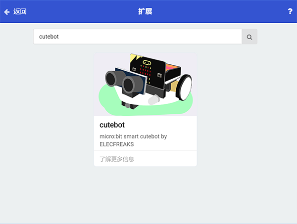
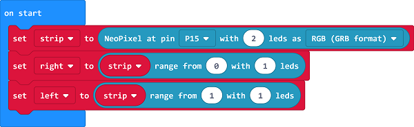
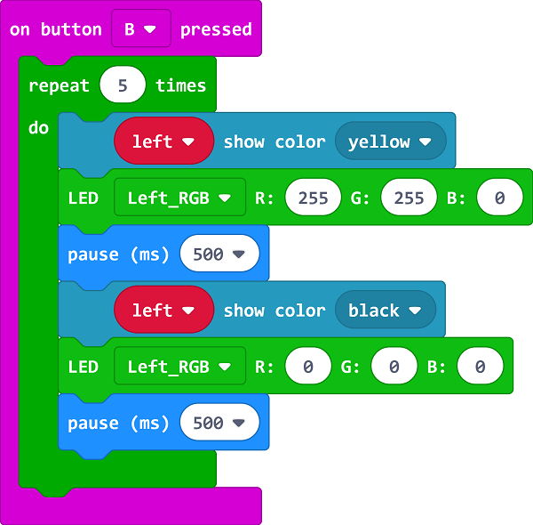

# Case 06: Steering&Clearance Lamps

## Purpose
---
- Make your  [Cutebot](https://www.elecfreaks.com/micro-bit-smart-cutebot.html) turn on its steering and clearance lamps when making a turn.

## Materials 
---
- 1 x [Cutebot Kit](https://www.elecfreaks.com/micro-bit-smart-cutebot.html)

## Software Platform
---
[MicroSoft makecode](https://makecode.microbit.org/#)

## Programming
---
### Step 1
- Click the "Advanced" to see more choices in the MakeCode drawer.

- A codebase is required for  [Cutebot](https://www.elecfreaks.com/micro-bit-smart-cutebot.html) programming, click “Add Package” at the bottom of the drawer, search ` [Cutebot](https://www.elecfreaks.com/micro-bit-smart-cutebot.html)` in the dialogue box and download it.

***Note:*** If you met a tip indicating incompatibility of the codebase, you can continue with the tips or build a new project there.

### Step 2

- Set `P15` as the two Rainbow LEDs connection port in the `On start` brick.
- Set the `right` LED ranging from `0` with `1` LED.
- Set the `left` LED ranging from `0` with `1` LED.

### Step 3

- Drag the `repeat` brick to `on button A pressed` brick, set the color of the right clearance lamp in yellow and the right LED in yellow(Controlled by RGB), then pause 500ms and turn off the clearance lamp and LED on the right side to complete the first flashing.

### Step 4

- Program in the  `on button B pressed` brick in the same way,  please note the right side should be changed to the left side.

### Programming

Links: [https://makecode.microbit.org/_bdWFDF4JD3Vk](https://makecode.microbit.org/_bdWFDF4JD3Vk)

You can also download it directly below:

<iframe style="position:absolute;top:0;left:0;width:100%;height:100%;" src="https://makecode.microbit.org/#pub:https://makecode.microbit.org/_bdWFDF4JD3Vk" frameborder="0" sandbox="allow-popups allow-forms allow-scripts allow-same-origin">
</iframe>

  

## Result
---
- After pressing button A, the LED and clearance lamp on the right side flashes 5 times.
- After pressing button B, the LED and clearance lamp on the left side flashes 5 times.

## Exploration
---
- How to program to press button A for turning on both lights while turning off by pressing button B ?

## FAQ
---

## Relevant Files
---
