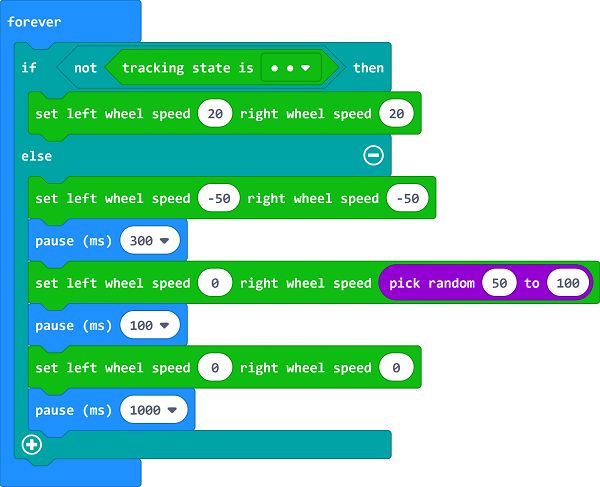

# Case 07: Fall-arrest Cutebot

## Purpose
---
- The Cutebot reverses quickly when detecting the edge of a table and goes forward after making a turn.

## Materials 
---
- 1 x [Cutebot Kit](https://www.elecfreaks.com/micro-bit-smart-cutebot.html)

## Software Platform 
---
[MicroSoft makecode](https://makecode.microbit.org/#)

## Programming
---
### Step 1
- Click the "Advanced" to see more choices in the MakeCode drawer.

- A codebase is required for Cutebot programming, click “Add Package” at the bottom of the drawer, search `Cutebot` in the dialogue box and download it.

Note: If you met a tip indicating incompatibility of the codebase, you can continue with the tips or build a new project there.

### Step 2

- Choose "show icon" in the `On start` brick.

### Step 3

- Drag `if` brick into `forever` brick and judge if both of the line-tracking sensors are detecting the edges of the black line, then set the right wheel speed to `20`. 
- If not, set the speed of both wheels as `-50` to reverse, pause `300ms` and keep the left wheel still but the right wheel moves at a random speed from 50~100 and lasts 100ms.
- Set the speed of both wheels to 0 and pause 1s to move forward again.

### Programming

Links: [https://makecode.microbit.org/_2z1hh4iEUgTY](https://makecode.microbit.org/_2z1hh4iEUgTY)

You can also download it directly below:

<iframe style="position:absolute;top:0;left:0;width:100%;height:100%;" src="https://makecode.microbit.org/#pub:https://makecode.microbit.org/_2z1hh4iEUgTY" frameborder="0" sandbox="allow-popups allow-forms allow-scripts allow-same-origin">
</iframe>

  
---

## Result
---
- The Cutebot reverses quickly when detecting the edge of a table and goes forward after making a turn.

## Exploration

## FAQ

------

## Relevant Files

---
