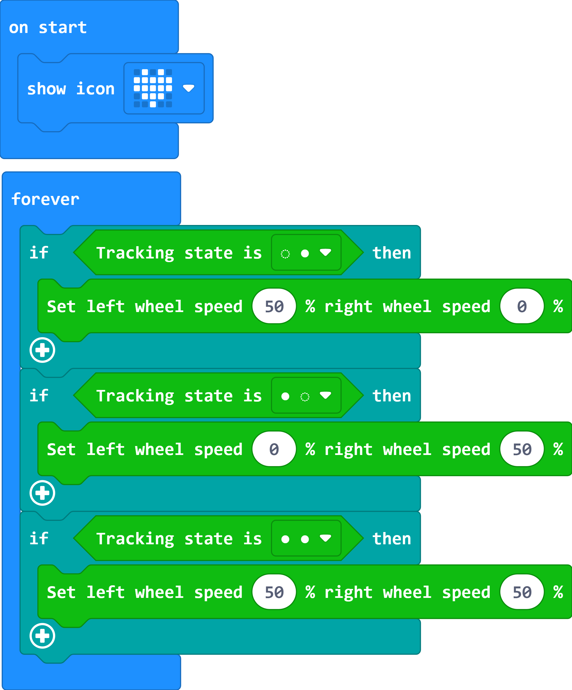

# Case 08: Run Along the Black Line

## Purpose
---
- The  [Cutebot](https://www.elecfreaks.com/micro-bit-smart-cutebot.html) runs along the black line.

## Materials 
---
- 1 x [Cutebot kit](https://www.elecfreaks.com/micro-bit-smart-cutebot.html)
- 1 x Line-tracking Map(Homemade or enclosed in the  [Cutebot kit](https://www.elecfreaks.com/micro-bit-smart-cutebot.html))

## Software Platform 
---

[MicroSoft makecode](https://makecode.microbit.org/#)

## Programming
---

### Step 1

- Click the "Advanced" to see more choices in the MakeCode drawer.

- A codebase is required for  [Cutebot](https://www.elecfreaks.com/micro-bit-smart-cutebot.html) programming, click “Add Package” at the bottom of the drawer, search ` [Cutebot](https://www.elecfreaks.com/micro-bit-smart-cutebot.html)` in the dialogue box and download it.

***Note:*** If you met a tip indicating incompatibility of the codebase, you can continue with the tips or build a new project there.

### Step 2

- Choose "show icon" in the `On start`brick.

### Step 3

- Drag three `if` bricks into the `Forever` brick.
- Judge if the status of line-tracking sensors is  ○ ●, saying the left probe doesn't detect the black line while the right probe detects the black line.
- Set the left wheel speed to `50` and right to `25`,  make a right turn by the different speed of the two wheels and go back to the black line.
- Judge if the status of line-tracking sensors is  ● ○ and make a left turn to go back to the black line.
- When the status is ● ● that means the  [Cutebot](https://www.elecfreaks.com/micro-bit-smart-cutebot.html) runs along with the black line at the speed of `50`. 

### Programming

Links: [https://makecode.microbit.org/_5j0YMhPK74yM](https://makecode.microbit.org/_5j0YMhPK74yM)

You can also download it directly below:

<iframe style="position:absolute;top:0;left:0;width:100%;height:100%;" src="https://makecode.microbit.org/#pub:https://makecode.microbit.org/_5j0YMhPK74yM" frameborder="0" sandbox="allow-popups allow-forms allow-scripts allow-same-origin">
</iframe>

  

## Result
---
- The  [Cutebot](https://www.elecfreaks.com/micro-bit-smart-cutebot.html) runs along the black line and will adjust to run back to the black line if any deviation happens.

## Exploration
---
- How to program to make the  [Cutebot](https://www.elecfreaks.com/micro-bit-smart-cutebot.html) run in the  white background of the map excluding the black line circle part? 

## FAQ
---

## Relevant Files
---
