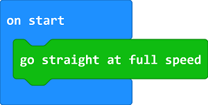
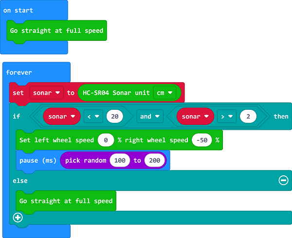

# Case 09: Autonomous Obstacle Avoidance

## Purpose
---
- The Cutebot avoids the obstacles automatically to move forward.

## Materials 
---
- 1 x [Cutebot Kit](https://www.elecfreaks.com/store/cute-bot.html)
- 1 x Ultrasonic Sensor

## Software Platform 
---
[MicroSoft makecode](https://makecode.microbit.org/#)

## Programming
---
### Step 1

- Click the "Advanced" to see more choices in the MakeCode drawer.

- A codebase is required for Cutebot programming, click “Add Package” at the bottom of the drawer, search `Cutebot` in the dialogue box and download it.

Note: If you met a tip indicating incompatibility of the codebase, you can continue with the tips or build a new project there.

### Step 2

- Drag "go straight at full speed" brick into the `On start` brick.

### Step 3

- Set a `Sonar` variable to  save the detected `Cm` value in the `Forever` brick.
- If the detected value is between `2` and `20` which means there is obstacle being detected in the front 20cm far, set the left wheel speed to `0` and right to `-50`, make a right turn at a random time to complete an obstacle avoidance.
- If not, move forward at its full speed.

### Programming

Links: [https://makecode.microbit.org/_hijb4L6ttgfc](https://makecode.microbit.org/_hijb4L6ttgfc)

You can also download it directly below:

<iframe style="position:absolute;top:0;left:0;width:100%;height:100%;" src="https://makecode.microbit.org/#pub:https://makecode.microbit.org/_hijb4L6ttgfc" frameborder="0" sandbox="allow-popups allow-forms allow-scripts allow-same-origin">
</iframe>

  
---

## Result
---
- The Cutebot moves forward at its full speed and will make a right turn to keep going if any obstacle being detected.

## Exploration
---
- Why should the detected value be over 2cm ?

## FAQ

------

## Relevant Files

---