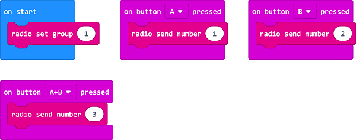
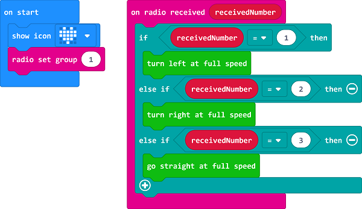

# Case 11: micro:bit Remote Control

## Purpose
---
- Use another micro:bit as a remote control for your [Cutebot](https://www.elecfreaks.com/micro-bit-smart-cutebot.html).
- Both micro:bit needs to be programmed.

## Materials 
---
- 1 x [Cutebot Kit](https://www.elecfreaks.com/micro-bit-smart-cutebot.html)
- 1 x [micro:bit](https://www.elecfreaks.com/microbit_edu.html)

## Software Platform 
---

[MicroSoft makecode](https://makecode.microbit.org/#)

## Programming
---

### Step 1

- Click the "Advanced" to see more choices in the MakeCode drawer.

- A codebase is required for [Cutebot](https://www.elecfreaks.com/micro-bit-smart-cutebot.html) programming, click “Add Package” at the bottom of the drawer, search `Cutebot` in the dialogue box and download it.

***Note:*** If you met a tip indicating incompatibility of the codebase, you can continue with the tips or build a new project there.

### Step 2: Remote Control Programming

- Set the "radio set group" to `1` in the `On start` brick.
-  Send radio number in `1` when pressing button A. 
- Send radio number in `2` when pressing button B.
- Send radio number in `3` when pressing button A+B.

#### Programming

links: [https://makecode.microbit.org/_9JCE5Ta78DL9](https://makecode.microbit.org/_9JCE5Ta78DL9)

You can also download it directly below:

<iframe style="position:absolute;top:0;left:0;width:100%;height:100%;" src="https://makecode.microbit.org/#pub:https://makecode.microbit.org/_9JCE5Ta78DL9" frameborder="0" sandbox="allow-popups allow-forms allow-scripts allow-same-origin">
</iframe>

  

### Step 3: [Cutebot](https://www.elecfreaks.com/micro-bit-smart-cutebot.html) Programming

- Drag "show icon" brick into the `On start` brick and set the "radio set group" to `1`. Items must be the same with the remote control for the correct match.
- Drag three "if" bricks into the `on radio received` brick and judge if the received number is `1`,  `2` or `3`.
- When the received number is `1`, turn left.
- When the received number is `2`, turn right.
- When the received number is `3`, go straight.

#### Programming

Links: [https://makecode.microbit.org/_eTEdPEKvRHEa](https://makecode.microbit.org/_eTEdPEKvRHEa)

You can also download it directly below:

<iframe style="position:absolute;top:0;left:0;width:100%;height:100%;" src="https://makecode.microbit.org/#pub:https://makecode.microbit.org/_eTEdPEKvRHEa" frameborder="0" sandbox="allow-popups allow-forms allow-scripts allow-same-origin">
</iframe>

  

## Result
---
- When button A+B being pressed on the remote control, the [Cutebot](https://www.elecfreaks.com/micro-bit-smart-cutebot.html) goes straight.
- When button A being pressed on the remote control, the [Cutebot](https://www.elecfreaks.com/micro-bit-smart-cutebot.html) turns left.
- When button B being pressed on the remote control, the [Cutebot](https://www.elecfreaks.com/micro-bit-smart-cutebot.html) turns right.

## Exploration
---

## FAQ
---

## Relevant Files
---
