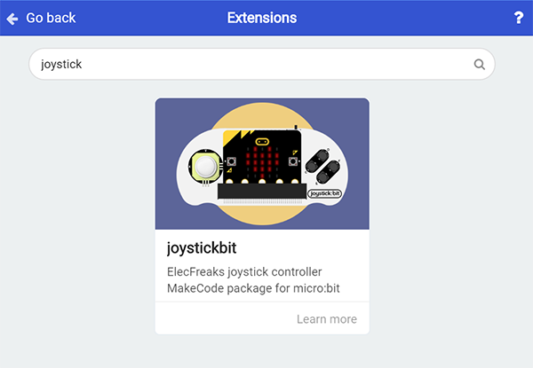
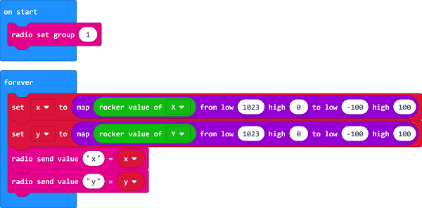
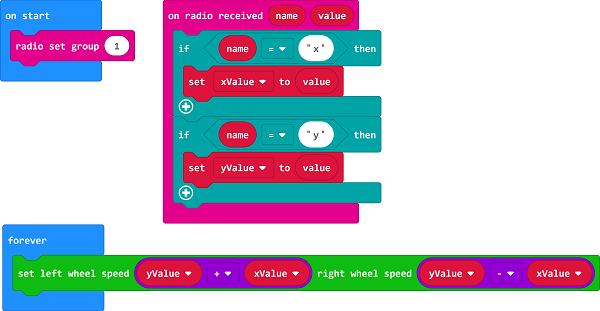

# Case 13: Remote Control with Joystick:bit

## Purpose
---
- Use the joystick:bit to control the Cutebot.

## Materials 
---
- 1 x [Cutebot Kit](https://www.elecfreaks.com/micro-bit-smart-cutebot.html)
- 1 x [Joystick:bit2](https://www.elecfreaks.com/joystick-bit-2-for-micro-bit.html)

## Software Platform 
---
[MicroSoft makecode](https://makecode.microbit.org/#)

## Programming

------

### Step 1

- Click the "Advanced" to see more choices in the MakeCode drawer.

- A codebase is required for Cutebot programming, click “Add Package” at the bottom of the drawer, search `Cutebot` in the dialogue box and download it.

- A codebase is required for Cutebot programming, click “Add Package” at the bottom of the drawer, search `joystic` in the dialogue box and download it.
- 

Note: If you met a tip indicating incompatibility of the codebase, you can continue with the tips or build a new project there.

### Step 2: Joystick:bit Programming

- Set "radio set group" to `1` in the `On start` brick.
- The scope for `X` and `Y` is `0~1023`, the theoretical value is `512`  if the rocker is in the middle place , in this way we need to make 0~1023 `map` map in the scope of `-100~100`. 
- Set `x` whose value is given by "acceleration (mg) x" exactly divides `10` to the radio value in `forever` brick.
- Set `y` whose value is given by "acceleration (mg) y" exactly divides `10` to the radio value in `forever` brick.
- The scope of the acceleration value is `0`~`1024` , which can be regarded roughly as the speed value in `0`~`100` after dividing `10`. 

#### Programming

Links: [https://makecode.microbit.org/_cVWKfb09E5st](https://makecode.microbit.org/_cVWKfb09E5st)

You can also download it directly below:

<iframe style="position:absolute;top:0;left:0;width:100%;height:100%;" src="https://makecode.microbit.org/#pub:https://makecode.microbit.org/_cVWKfb09E5st" frameborder="0" sandbox="allow-popups allow-forms allow-scripts allow-same-origin">
</iframe>

  

### Step 3: Cutebot Programming

- Set the "radio set group" to `1` in the `On start` brick. Items must be the same with the remote control for the correct match.
- Drag two "if" bricks into the `on radio received` brick and judge if the radio revived value `name` is `x` or `y`
- If the radio received value `name` is `x`, it is the data for `X` and then save the `value` in the variable `xValue`.
- If the radio received value `name` is `y`, it is the data for `y` and then save the `value` in the variable `yValue`.
- In `forever` brick, set the left wheel speed to `yValue`+`xValue` and right wheel speed to `yValue`-`xValue`.

#### Programming

Links: [https://makecode.microbit.org/_WDpVxaeTXdLT](https://makecode.microbit.org/_WDpVxaeTXdLT)

You can also download it directly below:

<iframe style="position:absolute;top:0;left:0;width:100%;height:100%;" src="https://makecode.microbit.org/#pub:https://makecode.microbit.org/_WDpVxaeTXdLT" frameborder="0" sandbox="allow-popups allow-forms allow-scripts allow-same-origin">
</iframe>

  

## Result
---
- The rocker controls the movement of the Cutebot.

## Exploration

------

## FAQ

------

## Relevant Files

---
