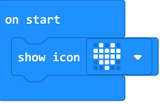
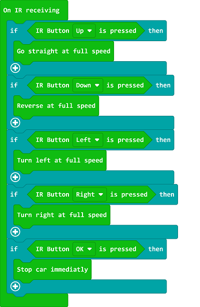

# Case 14: IR Remote Control Car

## Purpose
---
- Use an infrared remote control to give orders to the Cutebot. 

## Materials
---
- 1 x [Cutebot Kit](https://www.elecfreaks.com/micro-bit-smart-cutebot.html)
- 1 x [IR Remote Control](https://www.elecfreaks.com/infrared-remote-control.html)
## Software Platform
---
[MicroSoft makecode](https://makecode.microbit.org/#)

## Programming
---
### Step 1
- Click "Advanced" to see more choices in the MakeCode drawer. 

- We need to add a package for programming, click "Extensions" on the bottom of the drawer and search with "Cutebot“ in the dialogue box to download it. 

Note: If you met a tip indicating codebase will be deleted due to incompatibility, you may continue as the tips tell or build a new project. 

### Step 2

- Show an icon when on start.

### Step 3

- Set the car to move at its full speed while button "up" being pressed on the remote controller;  to reverse at its full speed while button "down" being pressed; to turn left at its full speed while button "Left" being pressed; to turn right at its full speed while button "Right" being pressed and to stop immediately while button "OK" being pressed. 

### Link

Link：[https://makecode.microbit.org/_2z1a3APfPLT3](https://makecode.microbit.org/_2z1a3APfPLT3)

You can also download it directly below:

<iframe style="position:absolute;top:0;left:0;width:100%;height:100%;" src="https://makecode.microbit.org/#pub:https://makecode.microbit.org/_2z1a3APfPLT3" frameborder="0" sandbox="allow-popups allow-forms allow-scripts allow-same-origin">
</iframe>

  
---

## Conclusion
---
- Programme to use the IR Remote Control to give orders of moving forward, reversing, turning left/right and stopping to the car. 

## Exploration
---

## FAQ
---
## Relevant File
---
