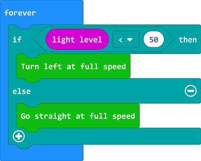

# Case15: Seeking the Light

## Purpose
---
- Programme to make the Cutebot seek the light source automatically. 

## Materials 
---
- 1 x [Cutebot Kit](https://www.elecfreaks.com/store/cute-bot.html)
## Software Platform 
---
[MicroSoft makecode](https://makecode.microbit.org/#)

## Programming
---
### Step 1
- Click "Advanced" in the MakeCode drawer to see more choices. 

- We need to add a package for programming, click "Extensions" on the bottom of the drawer and search with "Cutebot“ in the dialogue box to download it. 

Note: If you met a tip indicating the codebase will be deleted due to incompatibility, you may continue as the tips tell or build a new project. 

### Step 2

- Judge the luminous intensity with the block "light level " in "forever" ; if the value is below the setting point, set the Cutebot turn left at its full speed; Or it moves forward at its full speed.

### Link

Link: [https://makecode.microbit.org/_UatK2a6cgc7u](https://makecode.microbit.org/_UatK2a6cgc7u)

You can also download it directly below:

<iframe style="position:absolute;top:0;left:0;width:100%;height:100%;" src="https://makecode.microbit.org/#pub:https://makecode.microbit.org/_UatK2a6cgc7u" frameborder="0" sandbox="allow-popups allow-forms allow-scripts allow-same-origin">
</iframe>

  
---

## Result
---
- The Cutebot spins if there is no light being detected or it drives forward to it at its full speed. 

## Exploration
---

## FAQ
---
## Relevant Files
---