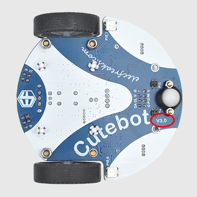
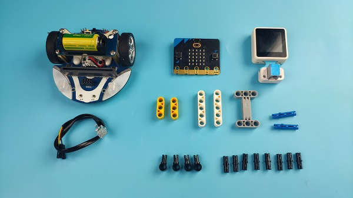
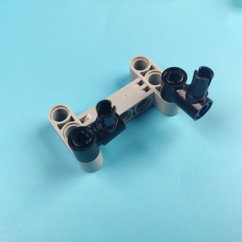
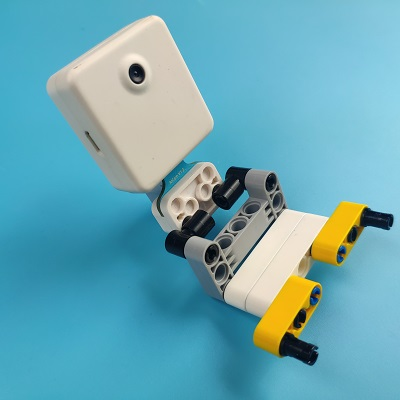
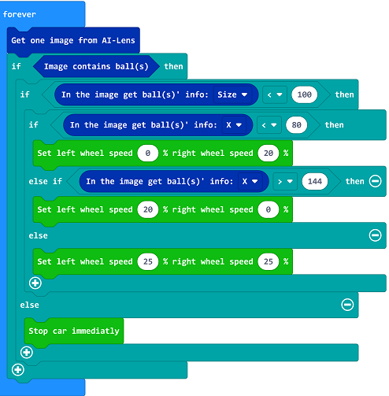

# Case19: AI Lens Balls Tracking

## Purpose 
---
- To make a ball-tracking Cutebot with the AI Lens. 

## Materials required

---

- 1 × [Cutebot V3.0](https://shop.elecfreaks.com/products/elecfreaks-micro-bit-smart-cutebot-kit-without-micro-bit-board?_pos=1&_sid=4c6909119&_ss=r)

- 1 × [Cutebot lithium battery pack](https://shop.elecfreaks.com/products/elecfreaks-cutebot-lithium-battery-pack?_pos=1&_sid=d60452574&_ss=r)

- 1 × [AI Lens Kit](https://shop.elecfreaks.com/products/elecfreaks-smart-ai-lens-kit?_pos=1&_sid=dcae9d30c&_ss=r)

  *Note: The AI Lens kit works with Cutebot V3.0 only(You can see the version number printed on the baseboard).*

## Connections:

---

### Steps to install the lithium battery pack: 

Assembly steps for bricks:

Parts list:

Steps of build-up:

### Connections of the AI Lens: 

Connect the RJ11 cable with the AI Lens and the other end in Dupont connection to the circled place in the below picture (make sure you connect to the right connections).

*Tips: the bricks holder here is flexible to be adjusted, we may manually adjust the angles of the AI lens to meet the requirements of the functions that you want to achieve.*

## Software Platform:

---

[MicroSoft MakeCode](https://makecode.microbit.org/#)

## Programming

---

### Step 1

Click “Advanced” in the drawer to see more choices.

- We need to add a package for programming. Click “Extensions” in the bottom of the drawer and search with “cutebot” in the dialogue box to download it.

We need to add a package for programming the AI lens kit. Click “Extensions” in the bottom of the drawer and search with “https://github.com/elecfreaks/pxt-PlanetX-AI” in the dialogue box to download it.

*Note: If you met a tip indicating that the codebase will be deleted due to incompatibility, you may continue as the tips say or build a new project in the menu.*

###  Step 2

- In the “on start” brick, initialize the AI lens and switch the function to the ball tracking mode.

- In the “forever” brick, set to get one image form the AI lens.
- If there is a ball in the image, judge the size of the ball. If the size detected is below 100, it means the ball is far from the Cutebot, and then get the place of the ball with a value from the X aixs, if the value is below 80, it means the ball is on the left front side of the Cutebot, we need set the speed of the left wheel at 0% and the right wheel at 20% to make the car turn left. If the value of the X axis is over 144, it means the ball is on the right front side of the Cutebot, we need set the speed of the left wheel at 20% and the right at 0% to make the car turn right; or we set both of the wheels at 25%; If the size of the ball is not less than 100, it means the ball is near the Cutebot, now we set the Cutebot to stop moving. 

### Code

Link: [https://makecode.microbit.org/_FWL7247fyfCk](https://makecode.microbit.org/_FWL7247fyfCk)

You may also download it directly below:

<iframe style="position:absolute;top:0;left:0;width:100%;height:100%;" src="https://makecode.microbit.org/#pub:https://makecode.microbit.org/_FWL7247fyfCk" frameborder="0" sandbox="allow-popups allow-forms allow-scripts allow-same-origin">
</iframe>

  
---

## Result
---
- The Cutebot goes for the ball if the AI Lens detects the ball and if the distance gets smaller enough, the Cutebot stops moving. 

## Exploration

---

## FAQ

---

## Relevant Files 

---
