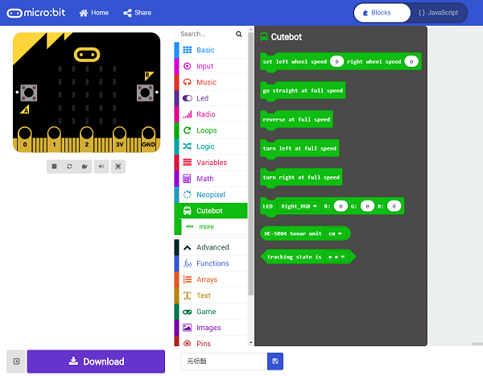
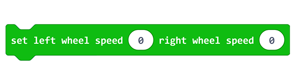
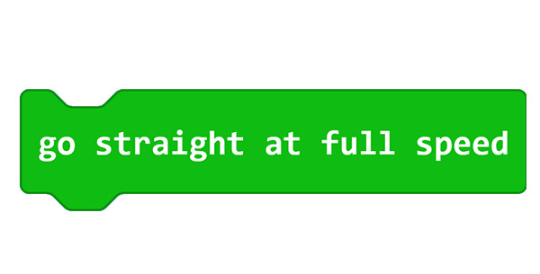
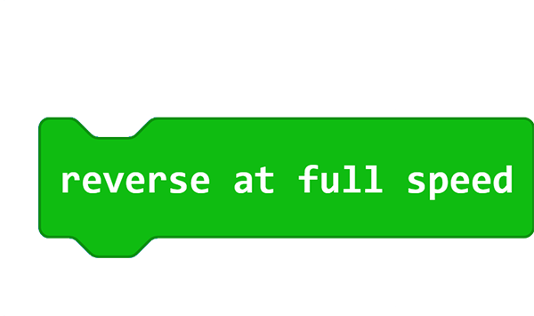
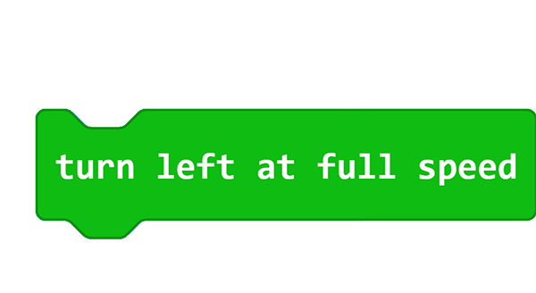
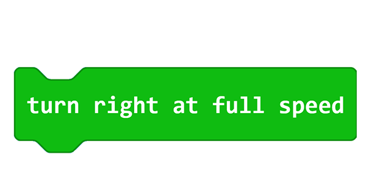
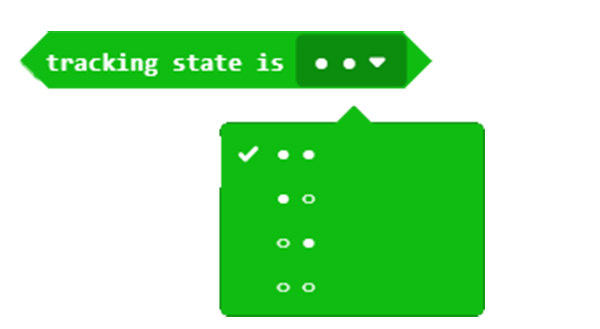
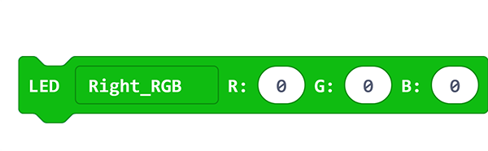

# Add Package for Cutebot

## Purpose
---
- A new package is required if you want to use the expansion bricks for [Cutebot](https://shop.elecfreaks.com/products/elecfreaks-micro-bit-smart-cutebot-kit-without-micro-bit-board?_pos=1&_sid=4c6909119&_ss=r).
- Steps for adding package are list below.

### Step 1

- Click "Extensions" in the "Advanced" drawer to see the adding bricks menu.

### Step 2 

- Search "cutebot" in the box and click it to add the package.

### Step 3

- Completed

## Bricks Introduction
---

- This brick helps to adjust the speed of both wheels.

- This brick helps the car to move at its full speed.

- This brick helps the car to reverse at its full speed.

- This brick helps the car to turn left at its full speed.

- This brick helps the car to turn right at its full speed.

- This brick helps to detect the line-tracking status for the line-tracking modules.

- This brick helps to detect the distance for the ultrasonic sensor.

- This brick helps to control the color of the RGB lights on both sides.

## FAQ
---

***Note:*** If you met a tip indicating incompatibility of the codebase, you can continue with the tips or build a new project there.

## Relevant Files
---
