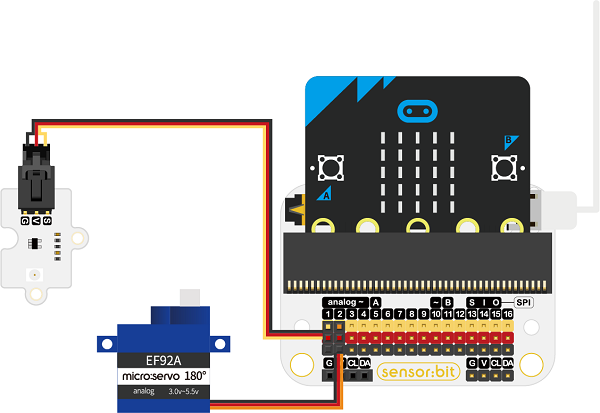
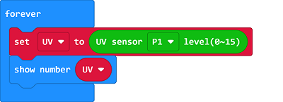
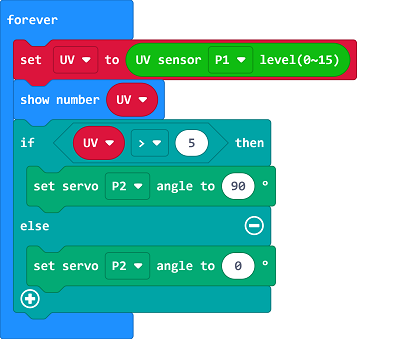

# Case 02: UV Light Detection Device

##  Introduction
---

- The most direct effect of excessive ultraviolet radiation is the gradual darkening of the skin. This is because ultraviolet rays cause a large amount of melanin to deposit in the epidermis, leading to permanent blackening, and the marks are not easy to fade; it will accelerate skin aging over time, about 90% of human skin aging is due to ultraviolet rays. Thus we can make a UV detection device for reminding.

## Function
---

- Detect the UV light intensity with the UV sensor, if the intensity is strong, program to drive the servo to lift the parasol.

## Products Link
---
- 1 x [micro:bit Smart Health Kit]()

## Picture
---

## Hardware Connection
---

Connect the UV sensor to P1 and the servo to P2 on sensor:bit. 

## Software Programming 
---

Click "Advanced" in the MakeCode to see more choices.

For programming, we need to add a package: click "Extensions" at the bottom of the MakeCode drawer and search with "smarthome" in the dialogue box to download it. 

For programming, we need to add a package: click "Extensions" at the bottom of the MakeCode drawer and search with "servo" in the dialogue box to download it. 

Notice: If you met a tip indicating that some codebases would be deleted due to incompatibility, you may continue as the tips say or create a new project in the menu. 

## Program 
---
Save the value detected from the UV sensor connecting to P1 as the variable "UV" and display the value on the micro:bit. 

Judge if the variable is over 5, if yes, set the servo connecting to P2 to drive to 0°; or to drive to 90°.

Link: [https://makecode.microbit.org/_exdb9fFJjeuj](https://makecode.microbit.org/_exdb9fFJjeuj)

<iframe style="position:absolute;top:0;left:0;width:100%;height:100%;" src="https://makecode.microbit.org/#pub:https://makecode.microbit.org/_exdb9fFJjeuj" frameborder="0" sandbox="allow-popups allow-forms allow-scripts allow-same-origin">
</iframe>

  

## Result
---
- If the intensity of the UV light is strong, program to lift the parasol. 

