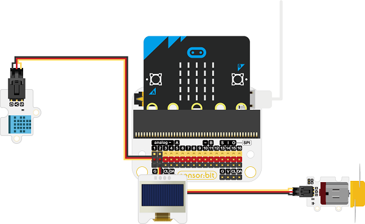
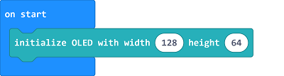
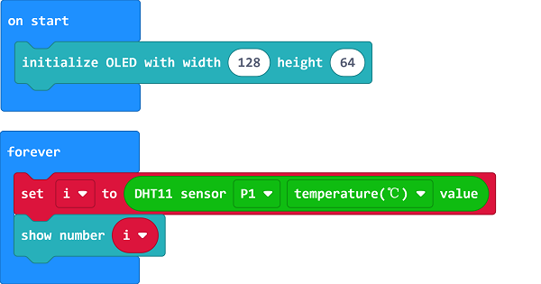
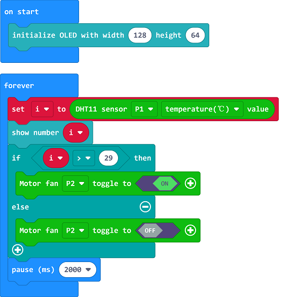

# Case 03: Temperature-controlled Fans

##  Introduction
---

- In a room with high temperature and dry air, our noses and throats are prone to dryness, congestion, pain, and sometimes nosebleeds. Also, people could become irritable, inattentive, poor accuracy and coordination with slower reaction speed in such a enviroment.  What's more, the body temperature regulation mechanism temporarily could become obstructed, and heat accumulation in the body occurs, which could lead to heat stroke easily, thus, a temperature-controlled fan could help a lot.

## Function
---

- Detect the temperature with the DHT11 sensor and display the value on the OLED screen, if the temperature is over the threshold, program to turn on the fan. 

## Products Link
---
- 1 x [micro:bit Smart Health Kit]()

## Picture
---

## Hardware Connection
---

Connect the DHT11 sensor to P1,  the motor fan to P2 and the OLED to IIC on sensor:bit. 

## Software Programming 

---

Click "Advanced" in the MakeCode to see more choices.

For programming, we need to add a package: click "Extensions" at the bottom of the MakeCode drawer and search with "smarthome" in the dialogue box to download it. 

Notice: If you met a tip indicating that some codebases would be deleted due to incompatibility, you may continue as the tips say or create a new project in the menu. 

## Program 

---
Initialize the OLED display. 

Save the returned value as the variable "i" and display it on OLED screen. 

Judge the value of the variable "i", if it's over 29, program to turn on the fan; or to turn off. 

Link: [https://makecode.microbit.org/_7WLC6kVYXh9z](https://makecode.microbit.org/_7WLC6kVYXh9z)

<iframe style="position:absolute;top:0;left:0;width:100%;height:100%;" src="https://makecode.microbit.org/#pub:https://makecode.microbit.org/_7WLC6kVYXh9z" frameborder="0" sandbox="allow-popups allow-forms allow-scripts allow-same-origin">
</iframe>

  

## Result
---
- Display the current temperature on the OLED, if the temperature is over 29℃, program to turn on the fan. 

