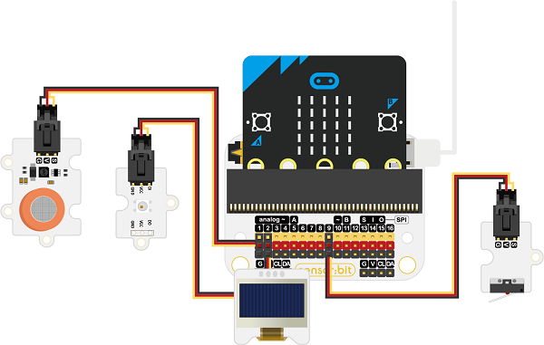
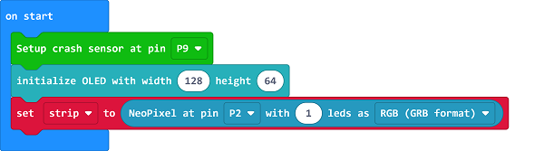
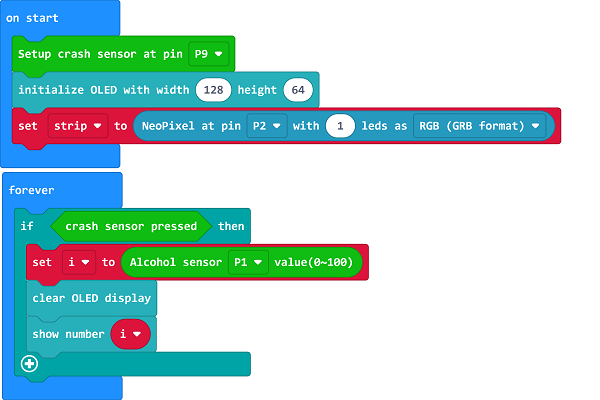
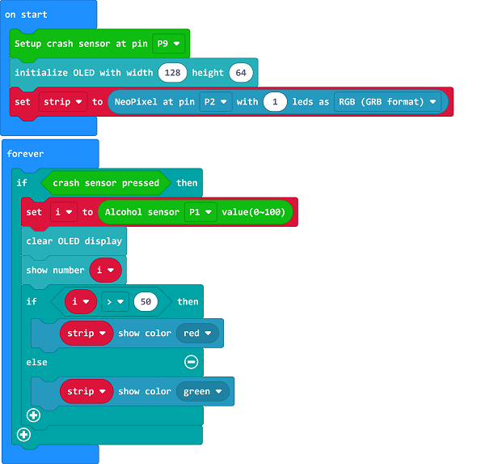

# Case 04: Alcohol Detection Device

##  Introduction
---

- If you drink a lot of alcohol in a short time, it is easy to cause gastric mucosal damage and gastric bleeding, thus, we could make an alcohol detection device for reminding. 

## Function
---

- Detect the concentration of the alcohol with the Alcohol sensor and display the value on OLED screen, if the concentration is over the threshold, program to turn on the red LED for reminding. 

## Products Link
---
- 1 x [micro:bit Smart Health Kit](https://www.elecfreaks.com/micro-bit-smart-health-kit-without-micro-bit-board.html)

## Picture
---

## Hardware Connection
---

Connect the alcohol sensor to PI, the rainbow LED to P2, the crash sensor to P9 and the OLED to IIC on sensor:bit. 

## Software Programming 
---

Click "Advanced" in the MakeCode to see more choices.

For programming, we need to add a package: click "Extensions" at the bottom of the MakeCode drawer and search with "smarthome" in the dialogue box to download it. 

For programming, we need to add a package: click "Extensions" at the bottom of the MakeCode drawer and search with "servo" in the dialogue box to download it. 

***Notice:*** If you met a tip indicating that some codebases would be deleted due to incompatibility, you may continue as the tips say or create a new project in the menu. 

## Program 
---
Drag the "on start" block from the drawer, set the crash sensor to connect to P9, initialize the OLED display and set the strip to connect to P2 with 1 led.  

While the crash sensor is pressed, save the returned value from the alcohol sensor connecting to P1 as the variable "i" and display it on the OLED screen. 

Judge the value of the variable "i", if it's over 50, set the rainbow LED to light on in red; or set it to light on in green. 

Link: [https://makecode.microbit.org/_1e3fAF0gp8Uv](https://makecode.microbit.org/_1e3fAF0gp8Uv)

<iframe style="position:absolute;top:0;left:0;width:100%;height:100%;" src="https://makecode.microbit.org/#pub:https://makecode.microbit.org/_1e3fAF0gp8Uv" frameborder="0" sandbox="allow-popups allow-forms allow-scripts allow-same-origin">
</iframe>

  

## Result
---
- Press the crash sensor to detect the alcohol concentration and display the value on the OLED screen, if the value is over the threshold, program to light on the LED in red; or light on the LED in green. 

