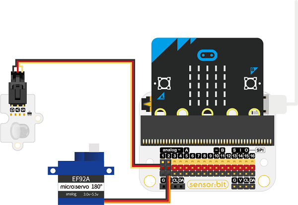
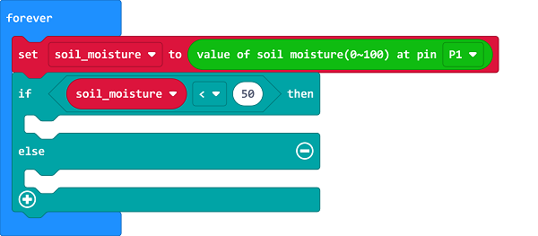
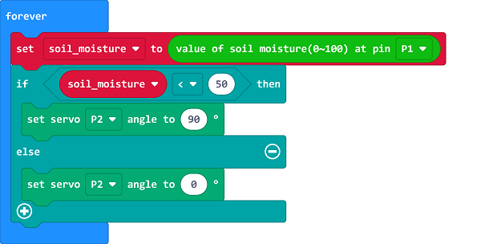

# Case 05: Indoor Flower Watering Device

##  Introduction
---

- Most plants can make us healthier, for example, one pot of green dill is equivalent to an air purifier in a room of 8-10 square meters, which can effectively absorb harmful gases such as formaldehyde, benzene and trichloroethylene in the air. Thus, we can make a simple watering device to help us take care of plants.

## Function
---

- Judge if the plant needs to be watered by detecting the moisture value, if the value is too low, program to drive the servo to open the water valve for watering. 

## Products Link
---
- 1 x [micro:bit Smart Health Kit](https://shop.elecfreaks.com/products/elecfreaks-micro-bit-smart-health-kit-without-micro-bit-board?_pos=1&_sid=2b45d49aa&_ss=r)

## Picture
---

## Hardware Connection
---

Connect the soil moisture sensor to P1 and the servo to P2 on sensor:bit. 

## Software Programming 

---

Click "Advanced" in the MakeCode to see more choices.

For programming, we need to add a package: click "Extensions" at the bottom of the MakeCode drawer and search with "smarthome" in the dialogue box to download it. 

For programming, we need to add a package: click "Extensions" at the bottom of the MakeCode drawer and search with "servo" in the dialogue box to download it. 

***Notice:*** If you met a tip indicating that some codebases would be deleted due to incompatibility, you may continue as the tips say or create a new project in the menu. 

## Program 
---
Connect the soil moisture sensor to P1 and save the returned value as the variable "soil_moisture".

Judge if the variable "soil_moisture" is below 50. 

If yes, it means the soil moisture value is too low, program to drive the servo connecting to P2 to drive to 90° to open the water valve for watering; or set the servo to drive to 0° to close the valve. 

Link: [https://makecode.microbit.org/_YhD7u8igkWMo](https://makecode.microbit.org/_YhD7u8igkWMo)

<iframe style="position:absolute;top:0;left:0;width:100%;height:100%;" src="https://makecode.microbit.org/#pub:https://makecode.microbit.org/_YhD7u8igkWMo" frameborder="0" sandbox="allow-popups allow-forms allow-scripts allow-same-origin">
</iframe>

  

## Result
---
- If the soil moisture value is below 50, program to water the plants automatically. 

