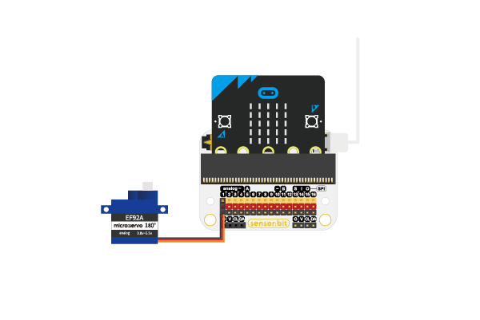
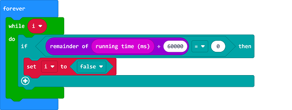
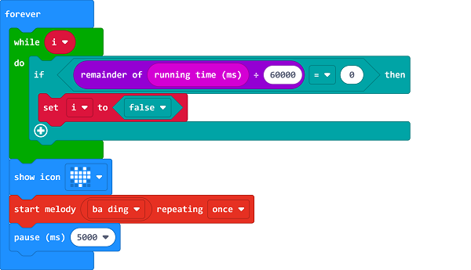
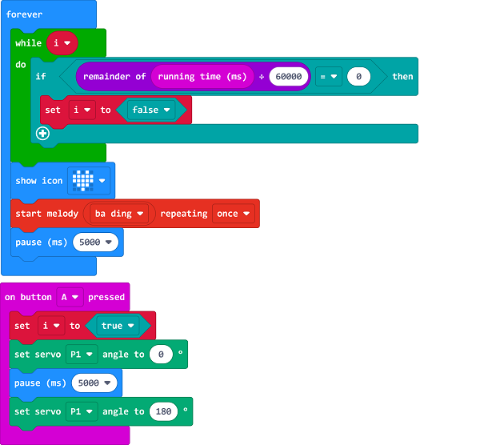

# Case 06: The Water Drinking Reminder 

##  Introduction
---

- Water is necessary for us and we can not live without water; water can regulate the circulation in the body, maintain the normal functions of the organs, and keep the body's metabolic process smooth; water is an important component of human cells and liquids, if there is water shortage,  the secretion of digestive juice decreases and appetite decreases; water plays an important role in body temperature regulation, if the outside temperature is high, it will evaporate water in the body to dissipate heat. Thus, we can make a device that reminds people to drink water regularly.

## Function
---

- At regular intervals, program to turn on the buzzer for reminding of drinking water, the water valve could be opened by pressing the buttons on the micro:bit, and program to turn off the valve after a few seconds. 

## Products Link
---
- 1 x [micro:bit Smart Health Kit](https://shop.elecfreaks.com/products/elecfreaks-micro-bit-smart-health-kit-without-micro-bit-board?_pos=1&_sid=2b45d49aa&_ss=r)

## Picture
---

## Hardware Connection
---

Connect the servo to P1 port on sensor:bit. 

## Software Programming 

---

Click "Advanced" in the MakeCode to see more choices.

For programming, we need to add a package: click "Extensions" at the bottom of the MakeCode drawer and search with "servo" in the dialogue box to download it. 

***Notice:*** If you met a tip indicating that some codebases would be deleted due to incompatibility, you may continue as the tips say or create a new project in the menu. 

## Program 

---
Judge if "i" is true in forever block, if yes, judge if the result caculated by running time dividing 60000 is 0, if yes, set "i" in false. 

If "i" is false, program to show icon and start palying the buzzer. 

While button A being pressed, program to set the variable "i" in true and program to drive the servo. 

Link: [https://makecode.microbit.org/_PH4YUi598FXc](https://makecode.microbit.org/_PH4YUi598FXc)

<iframe style="position:absolute;top:0;left:0;width:100%;height:100%;" src="https://makecode.microbit.org/#pub:https://makecode.microbit.org/_PH4YUi598FXc" frameborder="0" sandbox="allow-popups allow-forms allow-scripts allow-same-origin">
</iframe>

  

## Result
---
- Program to play the buzzer for reminding of drinking water every minute, and program to control the water valve through the buttons on the micro:bit and shut the valve for some time. 

