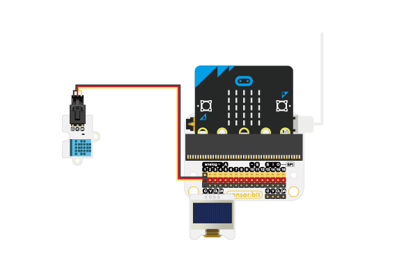
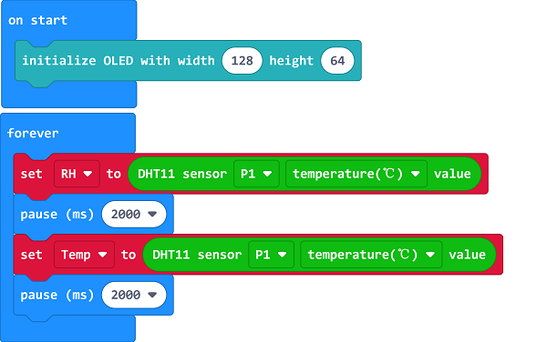
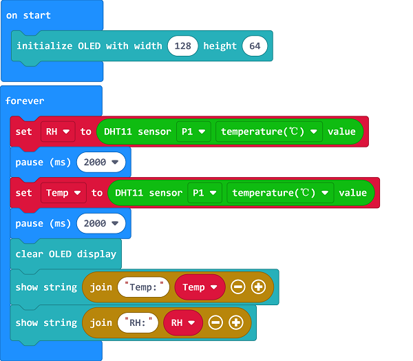

# Case 07: Humidity&Temp. Monitor 

##  Introduction
---

- The most comfortable indoors temperature for us is 15-18℃. If the indoor air is not circulating or the relative humidity is less than 35%, and the indoor temperature exceeds 25℃, we will begin to absorb heat from the outside which would make us feel hot. If the temperature exceeds 35°C, the sweat glands will start to activate, and the body temperature accumulates through sweating slightly, which could increase the heartbeat and accelerate blood circulation, we might feel dizzy and fatigue at the same time.
- A healthy humidity environment is 45%-65%. Such humidity conditions are the best to us, and various germs are not easy to spread. Humidity higher than 65% will cause discomfort to the human respiratory system and mucous membranes and reduce immunity.

## Function
---

- Detect the humidity and temperature from the DHT11 sensor and display them on the OLED screen. 

## Products Link
---
- 1 x [micro:bit Smart Health Kit]()

## Picture
---

## Hardware Connection
---

Connect the DHT11 sensor to P1 and the OLED to IIC on sensor:bit. 

## Software Programming 
---
Click "Advanced" in the MakeCode to see more choices.

For programming, we need to add a package: click "Extensions" at the bottom of the MakeCode drawer and search with "smarthome" in the dialogue box to download it. 

Notice: If you met a tip indicating that some codebases would be deleted due to incompatibility, you may continue as the tips say or create a new project in the menu. 

## Program 

---
Initialize the OLED screen. 

Save the returned value of the humidity from the DHT11 sensor connecting to P1 as the variable "RH" and the temperature as the variable "Temp", note a 2000ms pause is required in this operation due to the characteristics of the hardware. 

Clear the OLED screen and display the humidity and temperature value on the OLED screen. 

Link: [https://makecode.microbit.org/_Dqi8jjF750cV](https://makecode.microbit.org/_Dqi8jjF750cV)

<iframe style="position:absolute;top:0;left:0;width:100%;height:100%;" src="https://makecode.microbit.org/#pub:https://makecode.microbit.org/_Dqi8jjF750cV" frameborder="0" sandbox="allow-popups allow-forms allow-scripts allow-same-origin">
</iframe>

  

## Result
---
- Display the humidity and temperature value on the OLED screen.

