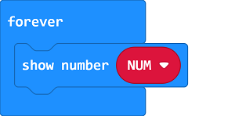
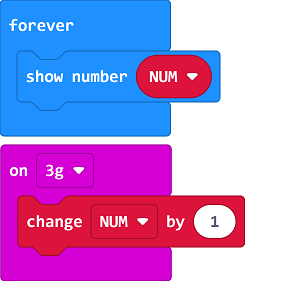
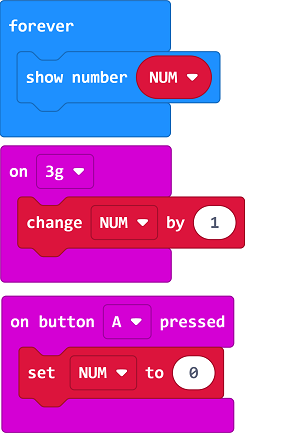

# Case 08: Step Counter

##  Introduction
---

- The step counter is a tool that measures calories or calorie consumption by counting steps, distance, speed, time and other data, it helps to control the amount of exercise and prevent insufficient exercise or excessive exercise.

## Function
---

- Count steps by the accelerometer from the micro:bit, and display the data on the micro:bit. 

## Products Link
---
- 1 x [micro:bit Smart Health Kit](https://www.elecfreaks.com/micro-bit-smart-health-kit-without-micro-bit-board.html)

## Picture
---

## Software Programming 
---

## Program 
---
Show number "MUM" on the micro:bit. 

Set NUM=NUM+1 while in shaking. 

While pressing button A, set "NUM" as 0. 

Link: [https://makecode.microbit.org/_5fT7CVV8dCiK](https://makecode.microbit.org/_5fT7CVV8dCiK)

<iframe style="position:absolute;top:0;left:0;width:100%;height:100%;" src="https://makecode.microbit.org/#pub:https://makecode.microbit.org/_5fT7CVV8dCiK" frameborder="0" sandbox="allow-popups allow-forms allow-scripts allow-same-origin">
</iframe>

  

## Result
---
- Display the steps data on the micro:bit and program to clear the data while pressing button A to start another counting. 

