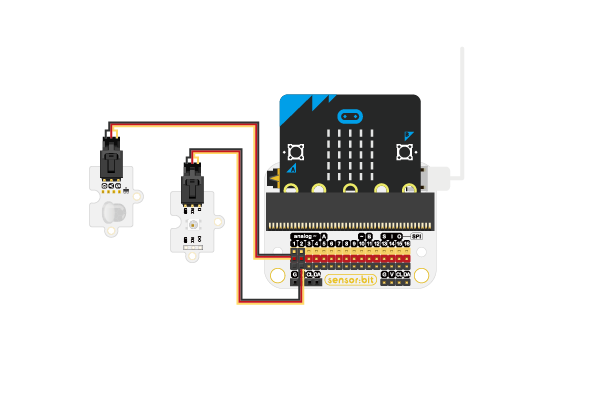
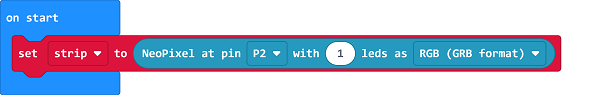
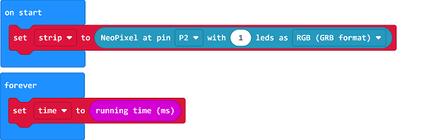
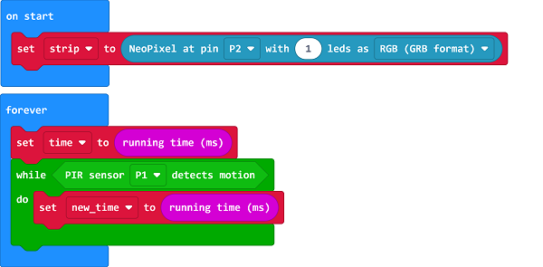
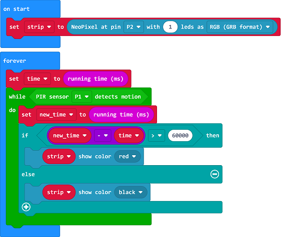

# Case 09: Sedentariness Reminder

##   Introduction
---

- When sitting still for a long time, the weight of the human body will be more concentrated on the lumbosacral area. This uneven pressure distribution can easily cause muscle strain and pain in the lower back. This can even cause the elasticity of the intervertebral disc tissue to decrease and the bone hyperplasia of the spine. As for the gastrointestinal tract, prolonged sitting causes slowing down of gastrointestinal motility. In addition to the relatively reduced secretion of digestive juices, which affects digestion, it can also cause and aggravate digestive system diseases such as bloating and constipation.

## Function
---

- Detect if there is anyone sitting in the chair, if yes, program to make a countdown from the start, and set the LED to light up if the sitting time is over the threshold. 

## Products Link
---
- 1 x [micro:bit Smart Health Kit]()

## Picture
---

## Hardware Connection
---

Connect the PIR sensor to P1 and the rainbow LED to P2 on sensor:bit. 

## Software Programming 
---

Click "Advanced" in the MakeCode to see more choices.

For programming, we need to add a package: click "Extensions" at the bottom of the MakeCode drawer and search with "smarthome" in the dialogue box to download it. 

***Notice:*** If you met a tip indicating that some codebases would be deleted due to incompatibility, you may continue as the tips say or create a new project in the menu. 

## Program 
---
Initialize the strip connecting to P2 with 1 led. 

Set the "time" as the running time in system. 

Detect if there is anyone sitting in the chair, if yes, set the variable "new_time"  as the running time. 

If the value given by the variable  "new_time"  deducting the variable "time" is over 60000, it means the one has sitted in the chair for more than 1 minute, then program to light on the rainbow LED. 

Link: [https://makecode.microbit.org/_XefWfY0eaEzT](https://makecode.microbit.org/_XefWfY0eaEzT)

<iframe style="position:absolute;top:0;left:0;width:100%;height:100%;" src="https://makecode.microbit.org/#pub:https://makecode.microbit.org/_XefWfY0eaEzT" frameborder="0" sandbox="allow-popups allow-forms allow-scripts allow-same-origin">
</iframe>

  

## Result
---
- If there is anyone sitting in the chair for over 1 minute, program to light on the LED. 

