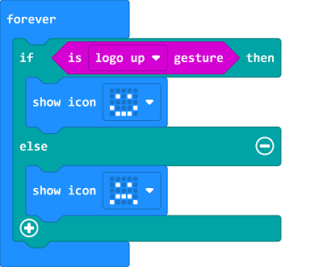
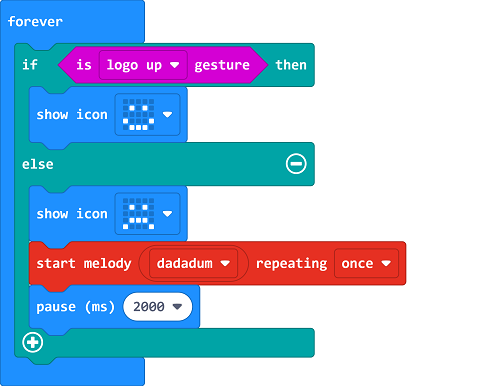

# Case 10: The Sitting Posture Reminder 

##  Introduction
---

- Prolonged incorrect sitting posture will not only affect the beauty of the body, but also cause the spine and pelvis to be tilted, and even cause health risks such as cervical spondylosis, lumbar spondylosis and pelvic inflammatory disease. Thus, we can make a sitting posture reminder. 

## Function
---

- Detect the micro:bit status from the accelerometer on the micro:bit, and then monitor the sitting posture. 

## Products Link
---
- 1 x [micro:bit Smart Health Kit]()

## Picture
---

## Software Programming 

---

## Program 

---
Judge if micro:bit is in "logo up", if yes, program to display a smile face. 

If the micro:bit displays a sad face, program to start melody for reminding. 

Link: [https://makecode.microbit.org/_Mws2cyWm6RFg](https://makecode.microbit.org/_Mws2cyWm6RFg)

<iframe style="position:absolute;top:0;left:0;width:100%;height:100%;" src="https://makecode.microbit.org/#pub:https://makecode.microbit.org/_Mws2cyWm6RFg" frameborder="0" sandbox="allow-popups allow-forms allow-scripts allow-same-origin">
</iframe>

  

## Result
---
- If the sitting posture is incorrect, the micro:bit would play a melody for reminding.

