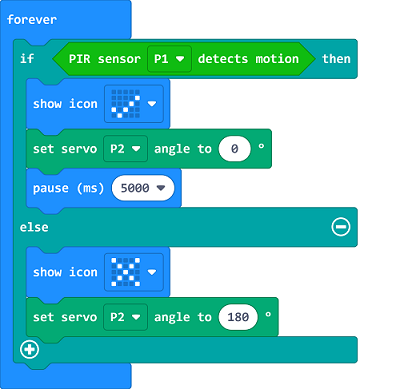

# Case 11: Smart Trash Can

##  Introduction
---

- If the trash can has no lid, it is easy to emit peculiar smell and affect the surrounding environment, but if the lid is closed and requires to be opened manually, it is easy to cause secondary pollution. Thus, we can design a smart trash can that automatically opens the lid when someone approaches.

## Function
---

- Detect if there are humans approaching with the PIR sensor, program to open the lid automatically when people come. 

## Products Link
---
- 1 x [micro:bit Smart Health Kit]()

## Picture
---

## Hardware Connection
---

Connect the PIR sensor to P1 and the servo to P2 on sensor:bit. 

## Software Programming 
---
Click "Advanced" in the MakeCode to see more choices.

For programming, we need to add a package: click "Extensions" at the bottom of the MakeCode drawer and search with "smarthome" in the dialogue box to download it. 

For programming, we need to add a package: click "Extensions" at the bottom of the MakeCode drawer and search with "servo" in the dialogue box to download it. 

***Notice:*** If you met a tip indicating that some codebases would be deleted due to incompatibility, you may continue as the tips say or create a new project in the menu. 

## Program 

---
Judge the value of the variable "IR", if yes, program to display a "√" and set the servo to drive to 0° to open the lid of the trash can; or to display a "×" and set the servo to drive to 180° to close the lid. 

Link: [https://makecode.microbit.org/_KuhhtHVds1EH](https://makecode.microbit.org/_KuhhtHVds1EH)

<iframe style="position:absolute;top:0;left:0;width:100%;height:100%;" src="https://makecode.microbit.org/#pub:https://makecode.microbit.org/_KuhhtHVds1EH" frameborder="0" sandbox="allow-popups allow-forms allow-scripts allow-same-origin">
</iframe>

  

## Result
---
- If there are people approching the cans, the lid would be opened automatically or it closes. 

