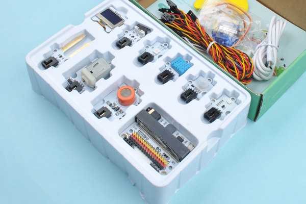
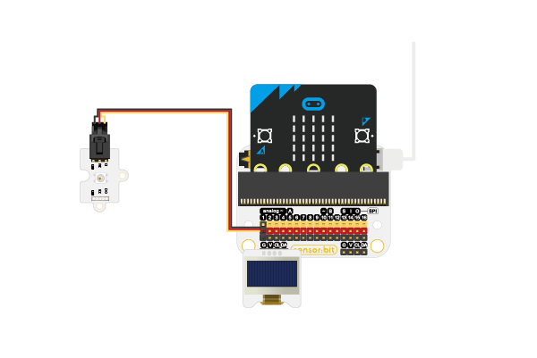
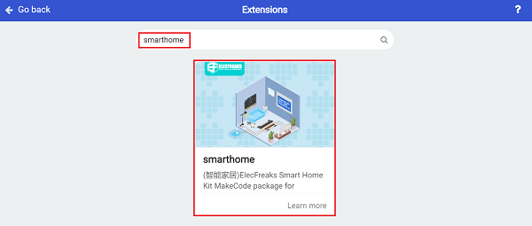
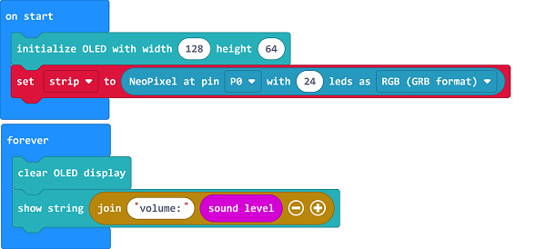
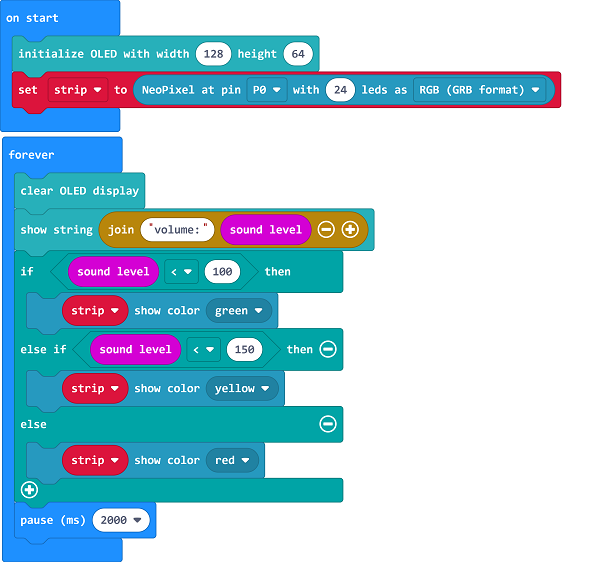

# Case 12: The Noise Detection in Classrooms

##  Introduction
---

 The harm of noise:

Severely affect central nervous system function, causing nervous system weakness and nervous system function disorders, such as long-term noise can cause insomnia, dreaminess, poor rest and sleep conditions, or poor rest and sleep quality, and deep sleep shortened phase, prolonged light sleep phase, or neurological headache, migraine, dreaminess and other clinical symptoms and manifestations.

Symptoms of insufficiency of blood supply to the heart. Long-term exposure to noise can cause coronary artery ischemia and transient vasospasm, resulting in chest tightness, shortness of breath, palpitations, and precordial discomfort.

Noise can also cause irreversible damage to the ear canal and auditory system, such as neurological tinnitus or even neurological deafness.

## Function
---

- The new micro:bit with sound has a built-in microphone sensor. It can react to loud and quiet sounds, and also measure how loud your environment is, use the micro:it to detect the sound level and display it on the OLED screen, and program to light on the LEDs in different colors in accordance with the sound level. 

## Products Link
---
- 1 x [micro:bit Smart Health Kit](https://www.elecfreaks.com/micro-bit-smart-health-kit-without-micro-bit-board.html)

## Picture
---

## Hardware Connection
---

Connect the rainbow LED to P1 and the OLED to IIC port on sensor:bit. 

## Software Programming 

---

Click "Advanced" in the MakeCode to see more choices.

For programming, we need to add a package: click "Extensions" at the bottom of the MakeCode drawer and search with "smarthome" in the dialogue box to download it. 

***Notice:*** If you met a tip indicating that some codebases would be deleted due to incompatibility, you may continue as the tips say or create a new project in the menu. 

## Program 

---
Initialize the OLED screen and display the sound level on it. 

If the sound level is below 100, program to light on in green; if the sound level is less than 150, program to light on in red. 

Link: [https://makecode.microbit.org/_MbT02YXJbHoo](https://makecode.microbit.org/_MbT02YXJbHoo)

<iframe style="position:absolute;top:0;left:0;width:100%;height:100%;" src="https://makecode.microbit.org/#pub:https://makecode.microbit.org/_MbT02YXJbHoo" frameborder="0" sandbox="allow-popups allow-forms allow-scripts allow-same-origin">
</iframe>

  

## Result
---
- Different colors of LEDs are turned on in accordance with the different sound levels. 

