# case 02 Smart Fan

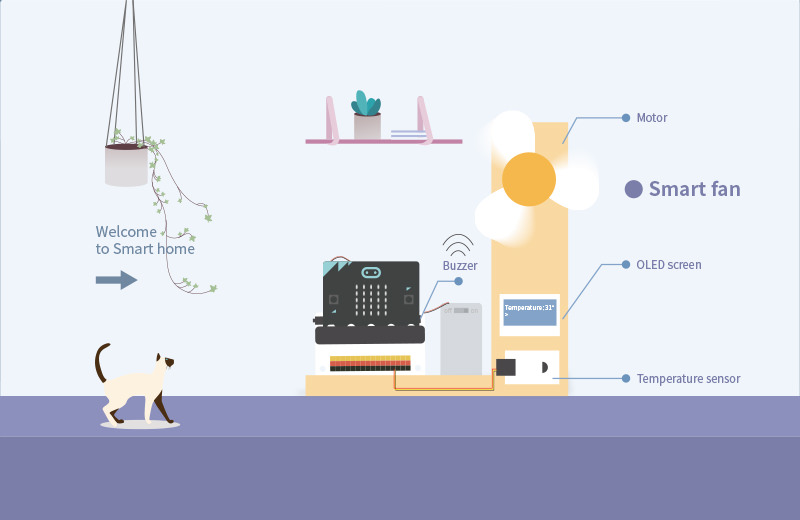
## Goal
---

- Make a smart temperature control fan. 

## Materials
---
- 1 x Smart home Kit
- 1 x corrugated board
- 2 x small sticks
- 1 x glue

## Background
---  
###Meaning of smart temperature control fan

- The smart temperature control fan is a created product base on smart home.That's say, science come from life.

### What is smart temperature control fan
- The room will at high temperature when temperature degree is higher than 30° and make people feel uncomfortable.The temperature sensor will send this signal to micro:bit，and micro:bit send this signal to the fan. Then, the fan will drive until the degree of room under 30° to keeping room at comfortable temperature.

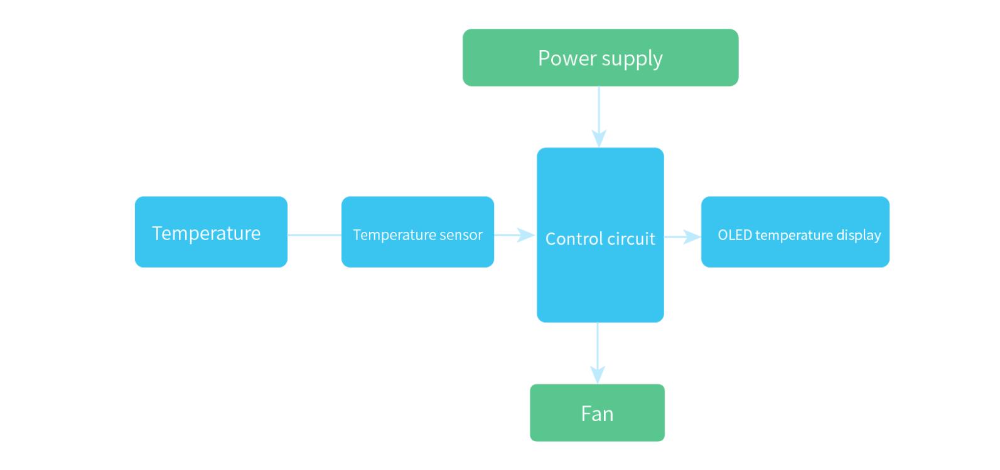

## Practical operation
---
Materials: corrugated board and cutter

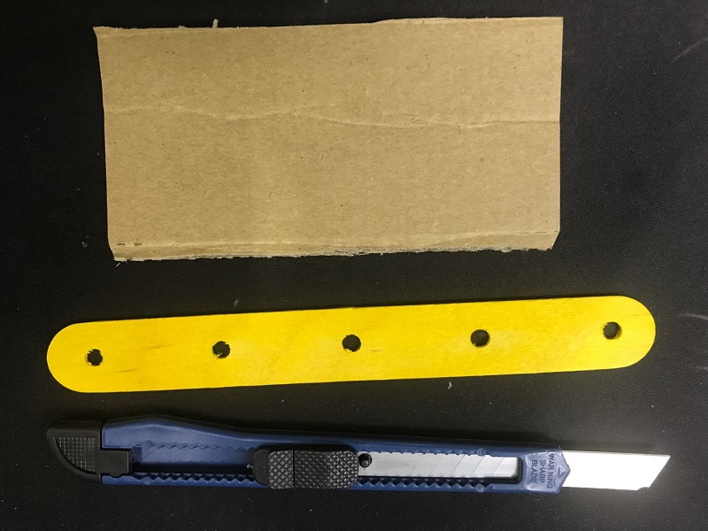

Build as below picture：

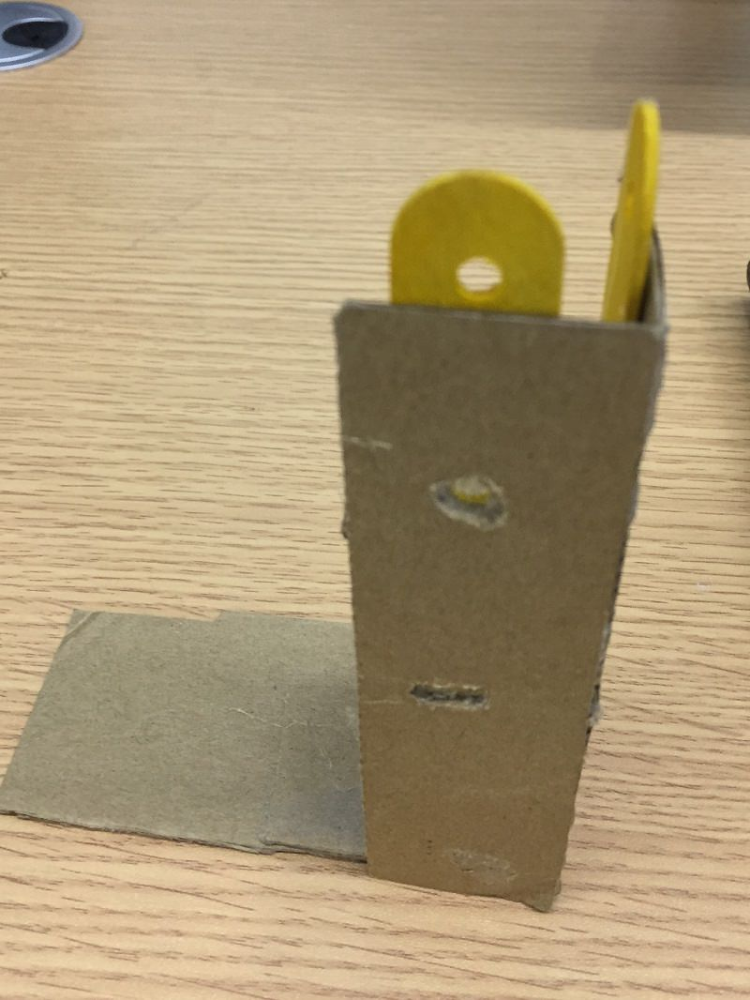

Side

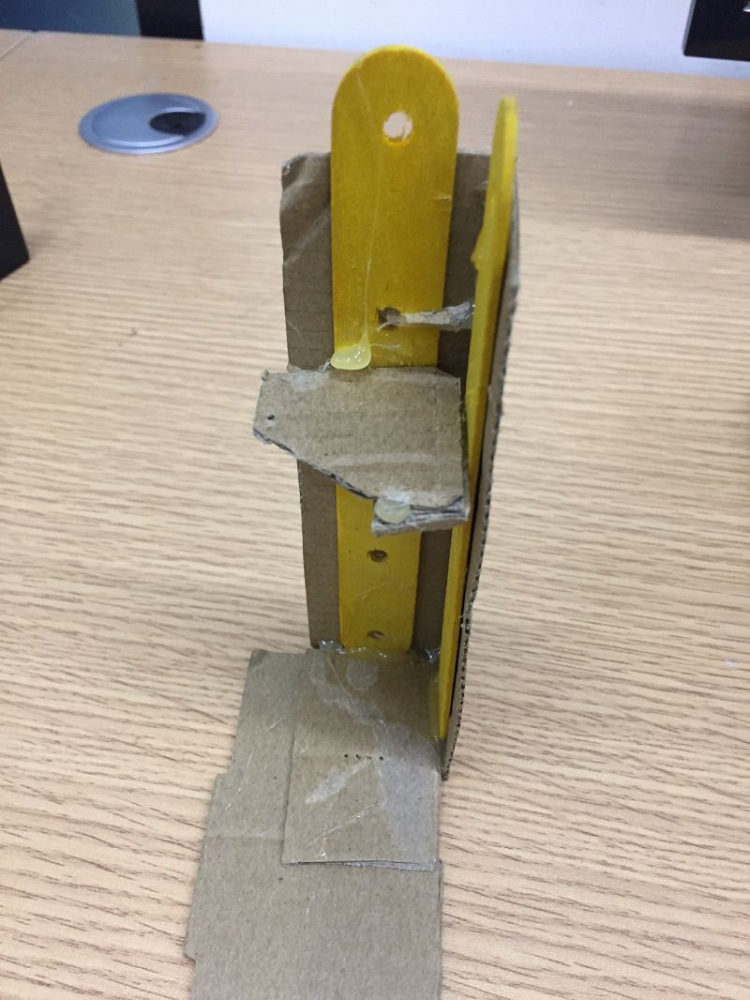

Paste devices as below piture:

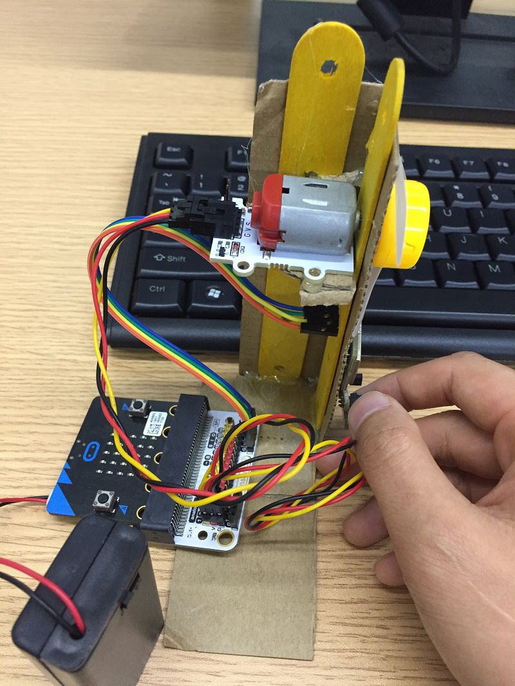

## Hardware connect
---

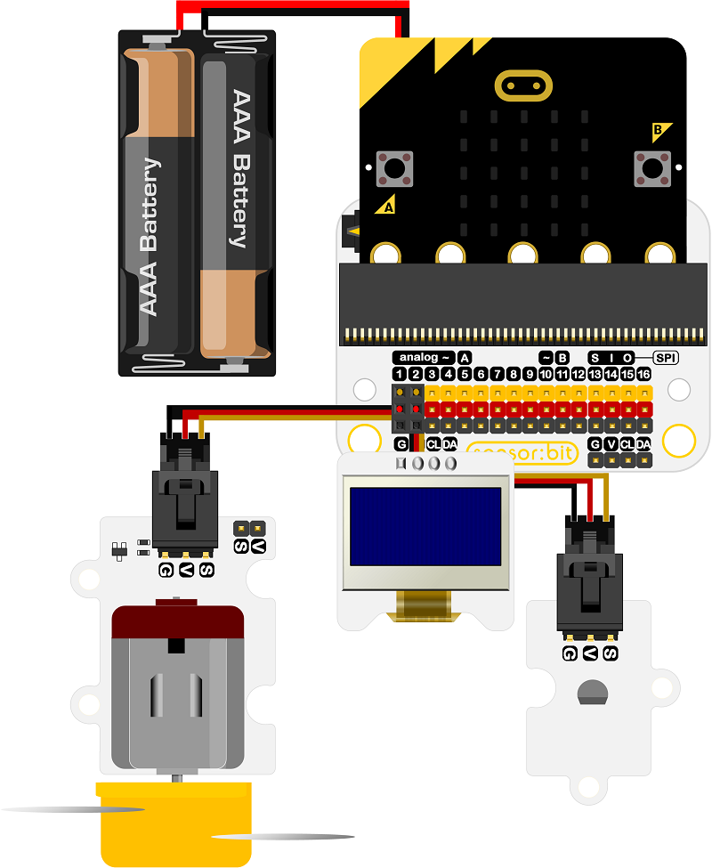

## Software
---
[makecode](https://makecode.microbit.org/#)

Edge Connector Data Sheet

## Programming
---
### Step 1

Go to MakeCode page, click Advanced in the code block and click on Extensions.

We need to add a new codebase for programming of smart home. Finding “Add Package” in the bottom of code block and click it. Then a message box will show up, search “smart home"， and download this new codebase.

Note：If there is a hint says some codebase will be deleted because of incompatibility. Don't worry. You could go ahead as the hint or build a new item in item menu bar.

### Step 2
Drag on start block from Basic and drag initialize OLED block from OLED, change height to 64, width to 128.

Drag forever block from Basic, add temp variables in Variable, then drag set item to snap into forever, change item to temp and drag value of temperature behind it. Change value of temperature to ℃ and at pin to P1. 

### Step 3

Now let's start OLED code.

Drag clear OLED display under set temp to. Then,drag show (without newline) string ‘Temperature’ under clear OLED display. Last, drag show(without newline) number temp."Without newline" is for newline displaying string and temperature value.

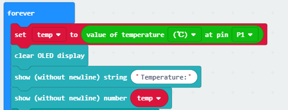

### Step 4

Our goal is using micro:bit driving the fan when the value of temperature is higher than 30°, so temp>30 is a judgement condition. In that way, we need drag "if else" from Logic, set temp>30. 

### Step 5

We add start melody repeating under if ,set melody to ba ding and repeat once，micro:bit will send signal to fan through P2. Then set fan works 5 seconds and stops 5 seconds. The temperature sensor judge whether go loop by gotting the temperature degree. Else means if above condistion were false, the fan will keep rest. 

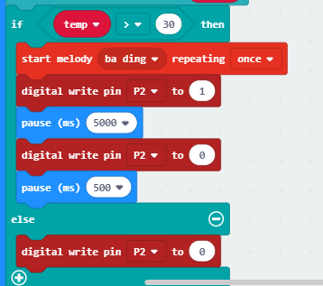

### Programming

Make code：[https://makecode.microbit.org/_PKXir0c1V6TX](https://makecode.microbit.org/_PKXir0c1V6TX)

You also could directly download program visit website as below:

<iframe style="position:absolute;top:0;left:0;width:100%;height:100%;" src="https://makecode.microbit.org/#pub:_PKXir0c1V6TX" frameborder="0" sandbox="allow-popups allow-forms allow-scripts allow-same-origin"></iframe>
  

## Result
---
When temperature degree is higher than 30°, buzzer "ba ding" , fan driving to keep room comfortable.

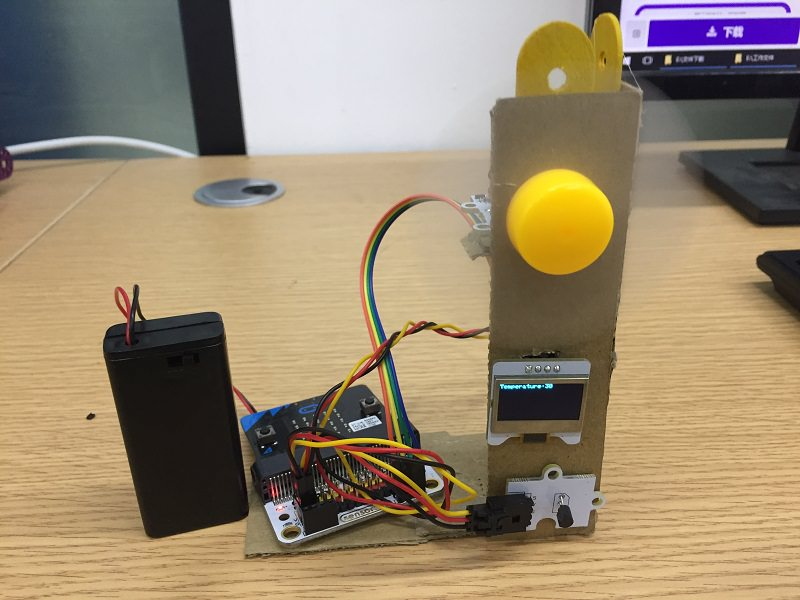

When temperature degree is less than 30°，the fan will automatically stop, and the room at comfortable temperature.

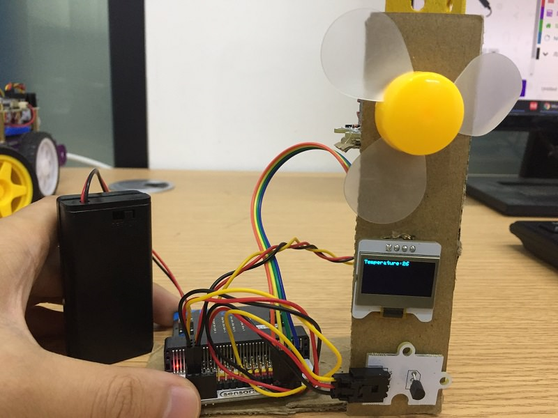

## Think
---
How to adjust speed of fan to control cooling rate in the room. 

## Questions
---
- It works well if powering by the USB only without the battery holders, but if the current temperature is over the threshold value, the fan doesn’t.
- If powering by the battery holders only without the USB, the fan works well and the detected temperature will be slightly higher than the real one.
- If powering by the battery holders and the USB simultaneously, the fan works well and it gets the normal temperature( Do note that you have to detect the temperature under the premise of the motor fan doesn’t drive).
- micro:bit v1.5 is okay to be powered via battery holder directly for this project, but if you are using micro:bit V2, please do use the sensor:bit in the new version(with USB connectors), and please power the project through the USB cable(powering from both wall power and computer are ok), and no need to connect with the battery holder on micro:bit V2.

## More information   
---
