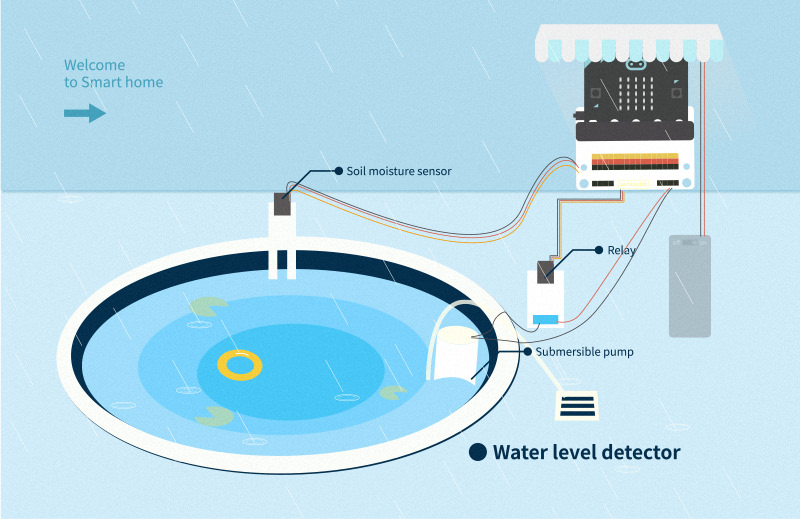
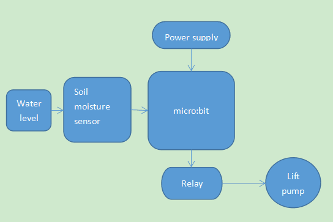
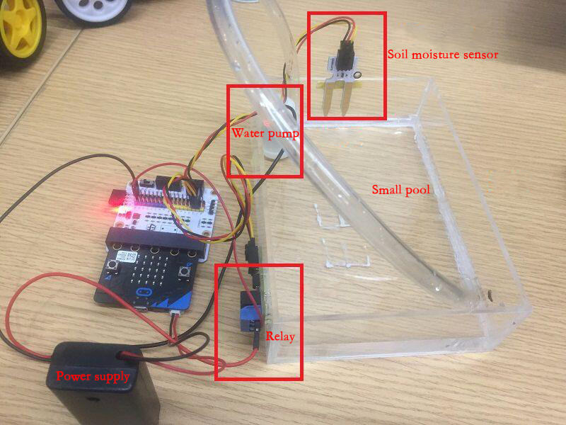
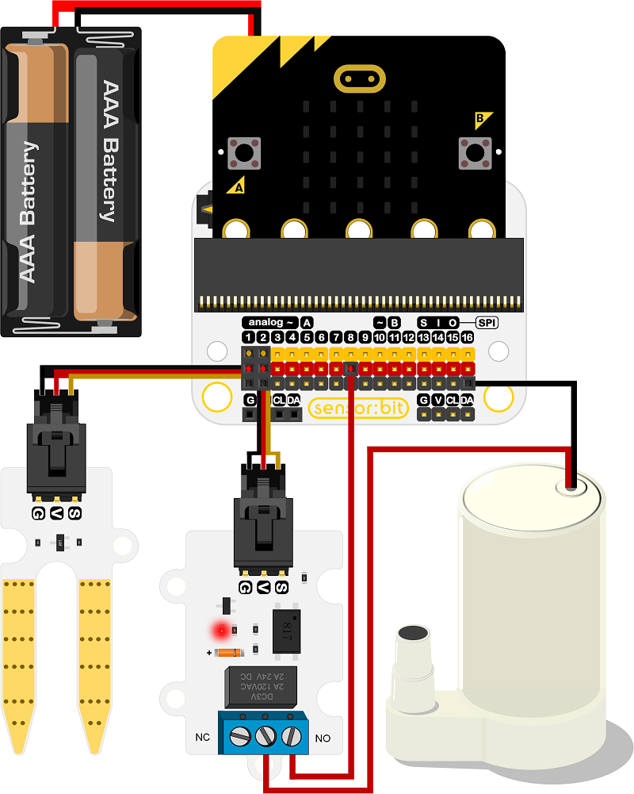
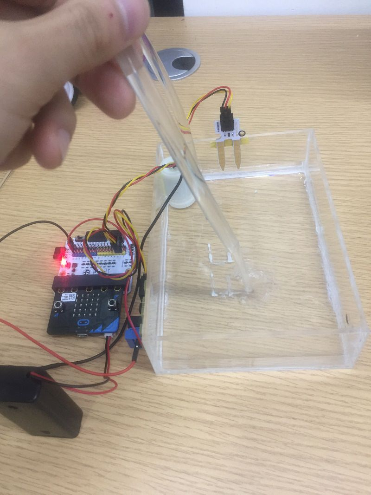
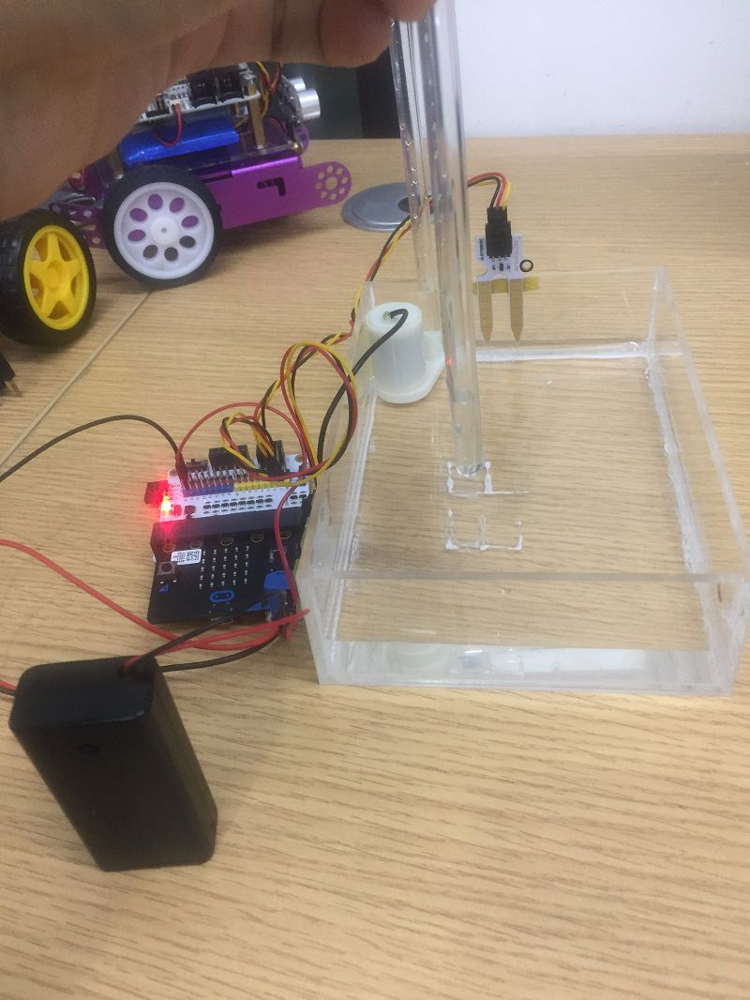

# case 05 Water Level Alarming

## Goal
---

- Make a water level alarming.

## Materials
---

- 1 x Smart home Kit]
- 1 x tank

## Background
---
### What is water level alarming 
- We can't live without water, but much water will cause flood. Water level alarming can detect water level, micro:bit will received signals when the water level over security line and control lift pump to pumping.

### Water level alarming operation
- When micro：bit received signal of soil moisture sensor,relay will drive and supply power to lift pump for pumping redundant water.

## Practical operation
---
Preparing a tank and paste devices as below piture:

## Hardware connect
---

## Software
---
[makecode](https://makecode.microbit.org/#)

Edge Connector Data Sheet

## Programming
---
### Step 1
Go to MakeCode page, click Advanced in the code block and click on Extensions.

We need to add a new codebase for programming of smart home. Finding “Add Package” in the bottom of code block and click it. Then a message box will show up, search “smart home"， and download this new codebase.

Note：If there is a hint says some codebase will be deleted because of incompatibility. Don't worry. You could go ahead as the hint or build a new item in item menu bar.

### Step 2

Snap if statement into forever,set analog read pin P2 > 500, that's say when P2 > 500, the water level is higher than security line.

### Step 3

Set start melody "ba ding" repeating once as alarming voice, set digital write pin P1 to 1 as driving the pumping.

### Step 4
Else，set digital write pin P1 to 0 as turning off the pump.

### Programming

Make code：[https://makecode.microbit.org/_9KqHhp1J45ho](https://makecode.microbit.org/_9KqHhp1J45ho)

You also could directly download program visit website as below:

<iframe style="position:absolute;top:0;left:0;width:100%;height:100%;" src="https://makecode.microbit.org/#pub:_9KqHhp1J45ho" frameborder="0" sandbox="allow-popups allow-forms allow-scripts allow-same-origin"></iframe>
  
---

## Result
---
When the water level over security line,micro:bit will control lift pump to pumping.

Pumping:

Stop pumping:

## Think
---
How to use micro:bit control water level in fish tank ?

## Questions
---

## More information  
---

