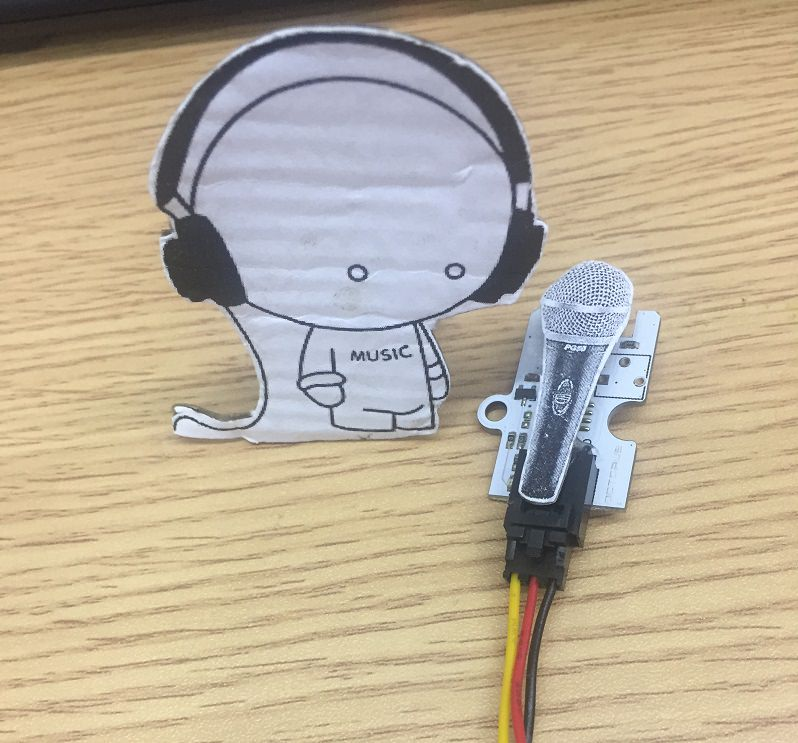
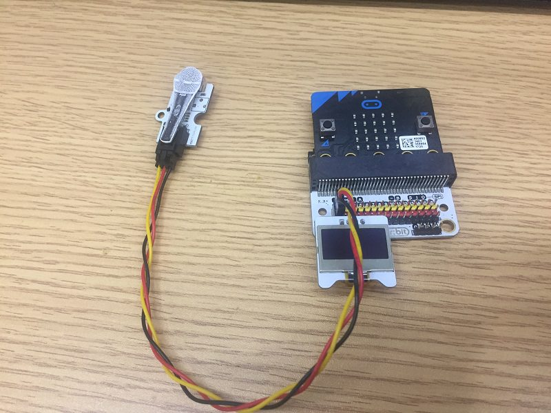
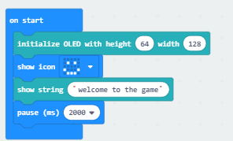
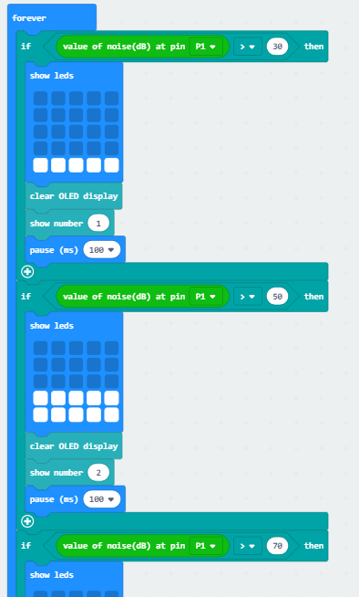
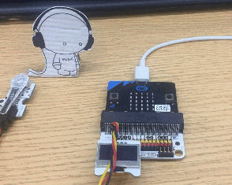

# case 08 simple spirometer

## Goal
---

- Make a simple spirometer.

## Required Materials
---

- 1 X Smart Home Kit

## Background
---

- The analog noise sensor E-Blocks can sense the outside noise signal. It can sense the vibration in air. The greater the vital capacity, the more air is expelled, and the greater the impact on the air. The air intensity is a detection index for a spirometer.

### What is a "simple spirometer" ?

- The spirometer always use in physical examination for testing health. Using the micro:bit to make a simple spirometer and know your own physical condition.

### Principle of a simple spirometer

- The analog noise sensor E-Blocks detects the vibration in air. Then you need to make 5 levels for your vital capacity.

---

Level | Parameters 
:-: | :-: 
1|30db
2|50db
3|70db
4|90db
5|110db

## Practical Operation
---

- Prepare a scissors, a bottle of glue and a piece of cardboard.
- Stick the paper you prepared on the cardboard and clip it as you need.
- Set up as below：

Set and stick components as below:

## Hardware Connect
---
Connect the analog noise sensor to the P1 port of the expansion board.
Connect the OLED screen the the IIC port of the expansion board.

## Software
---
[makecode](https://makecode.microbit.org/#)
 

## Programming
---
### Step 1

- Click "Advanced" in the makecode code drawer for more codes.

- We need to add a new codebase for programming of smart home. Finding “Extensions” at the bottom of code block and click it. Then a message box will show up, search “smart home"， and download this new codebase.

Note：If there is a hint says some codebase will be deleted because of incompatibility. Don't worry. You could go ahead as the hint or build a new item in the item menu bar.

### Step 2

Snap the on start from the Basic, snap the initialize OLED with block from the OLED and initialize the OLED screen.
Then set a smile icon on the micro:bit for micro:bit' boot animation.
Show the welcome to the game string on the OLED screen which means the test starts.

### Step 3

Snap an if statement under the forever loop. Read the value of the P1 port and judge what the level it is.
The micro:bit's LED will show different height histogram for different levels. The icon will in full screen at the highest level.
The OLED scren will show different numbers for different levels. It will show number 5 at the highest level.
Duplicate above codings and judge 5 levels.

### Program

Program link：[https://makecode.microbit.org/_R8yPcAPMDJXM](https://makecode.microbit.org/_R8yPcAPMDJXM)

You also could directly download program by visiting website as below:

<iframe style="position:absolute;top:0;left:0;width:100%;height:100%;" src="https://makecode.microbit.org/#pub:_R8yPcAPMDJXM" frameborder="0" sandbox="allow-popups allow-forms allow-scripts allow-same-origin"></iframe>
  

## Result
---

- Blow to the analog noise sensor, you will know your vital capacity

## Think
---

- What can we make by using the smart home kit except the spirometer

## Questions
---

## More Information
---

