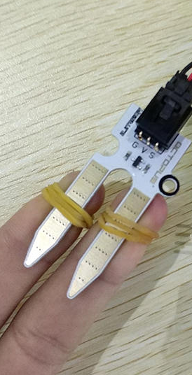
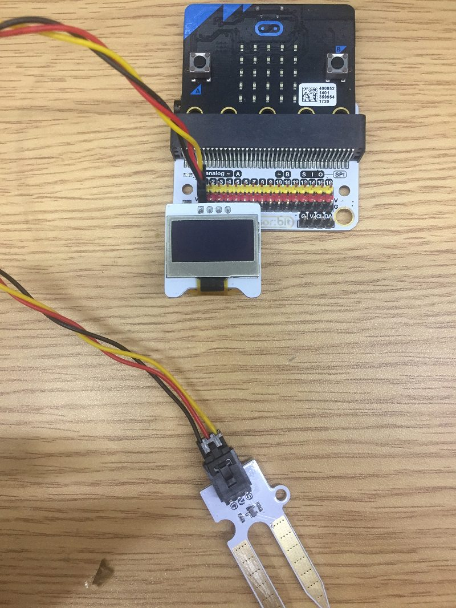
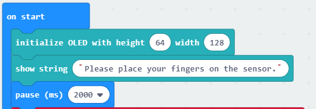
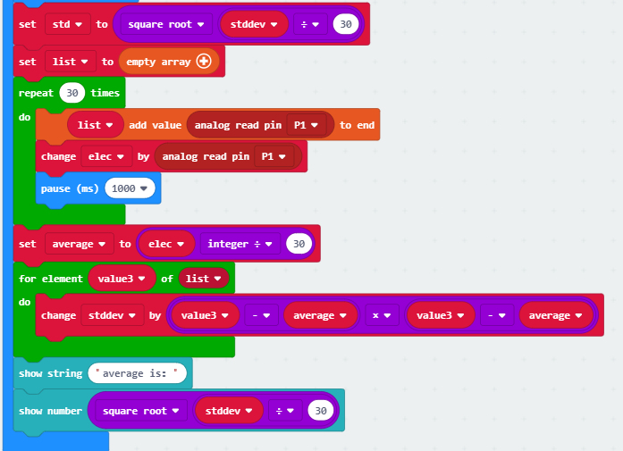
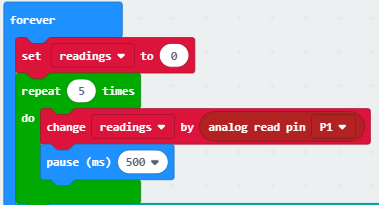
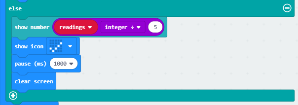

# case 09 lie detector

## Our Goal
---

- Make a lie detector.

## Materials
---
- 1 X Smart Home Kit

## Background
---

- Use a moisture sensor to detect material's electrical conductivity.

### What is a lie detector?

- With this machine, the truth will never escape you!

### Pre Build Overview

- In this project, we will create a simple lie detector machine, which works by measuring the electrical conductivity of our skin. Upon feeling nervous, our skin’s electrical conductivity will increase, and the moisture sensor can pick up on that. This allows us to determine if a person is telling the truth or not.

## Practical Operation
---

- A quiet and comfort room. Operation as below picture:

## Hardware Connect
---
Connect the soil moisture sensor to P1 of the expansion board.
Slot the OLED screen into IIC port of the expansion board.

## Software
---
[makecode](https://makecode.microbit.org/#)
 

## Programming
---
### Step 1

- Click "Advanced" in the makecode code drawer for more codes.

- We need to add a new codebase for programming of smart home. Finding “Extensions” at the bottom of code block and click it. Then a message box will show up, search “smart home"， and download this new codebase.

***Note：*** If there is a hint says some codebase will be deleted because of incompatibility. Don't worry. You could go ahead as the hint or build a new item in the item menu bar.

### Step 2

- First of all, initialize the OLED using blocks in the OLED section as shown in the picture.

### Step 3

- This part of the code allows the soil moisture sensor to measure and record down the electrical conductivity between the two fingers every few seconds for about a minute. Then, it calculates the average. This is the “calm” value when the user has not told any lies.

### Step 4

- After the initial readings have been made and recorded, the moisture sensor now measures the average electrical conductivity over five seconds. 

### Step 5

- After the initial readings have been made and recorded, the moisture sensor now measures the average electrical conductivity over five seconds. If it is higher than the average added to the standard deviation, we can conclude that the user has an abnormally high electrical conductivity and is thus lying. Then, the LED screen would show an “X”shape.

### Step 6

- If it is lower than the average added to the standard deviation, we can conclude that the user has a normal electrical conductivity and is thus no lying. Then, the LED screen would show an “√”shape.

### Program

Program link：[https://makecode.microbit.org/_gvHXo5WVM8cP](https://makecode.microbit.org/_gvHXo5WVM8cP)

You also could directly download program by visiting website as below:

<iframe style="position:absolute;top:0;left:0;width:100%;height:100%;" src="https://makecode.microbit.org/#pub:_gvHXo5WVM8cP" frameborder="0" sandbox="allow-popups allow-forms allow-scripts allow-same-origin"></iframe>
  

## Result

---

- You will have to attach each prong of the soil moisture sensor to one of your fingers. After 10 seconds, the test will begin. The LED screen will show an “X”shape when the player is lying; The LED screen will show an “√” shape when the player is telling the truth.

## Think
---

- Is there any way to make the result more accurate? 

## Questions
---

## More Information 
---

