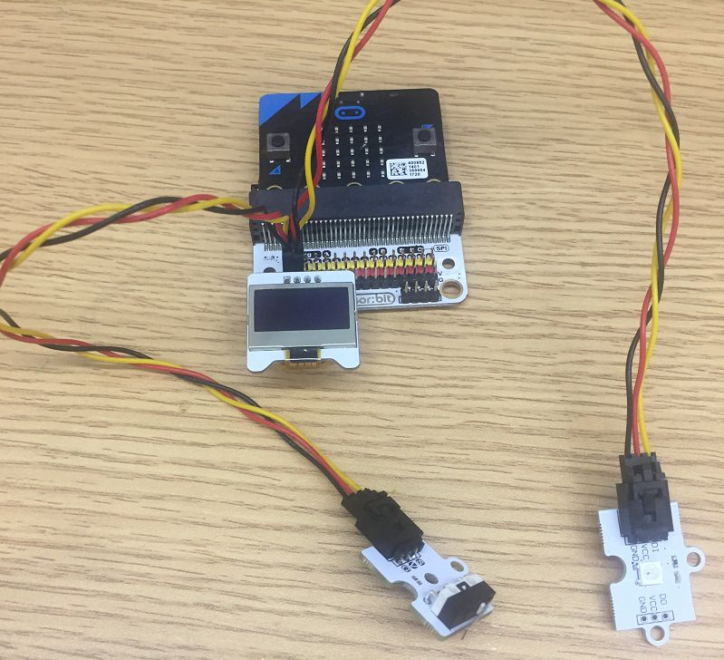
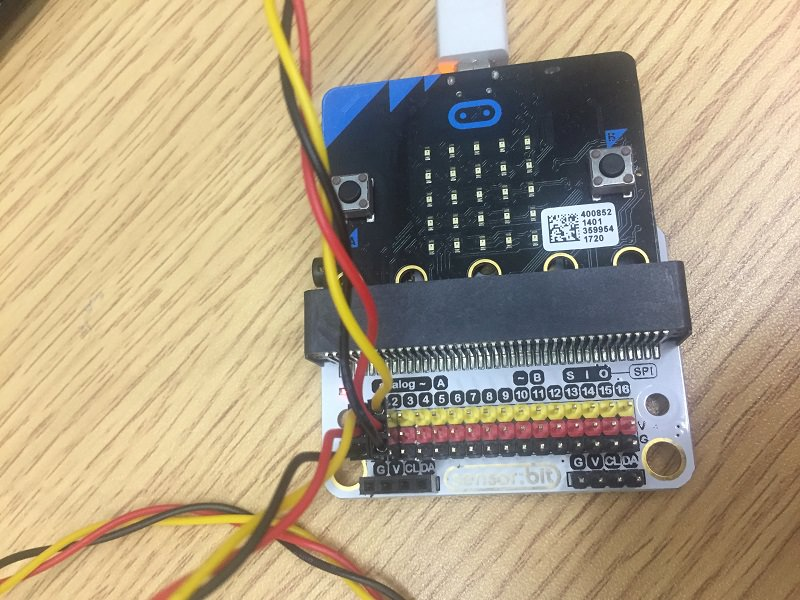
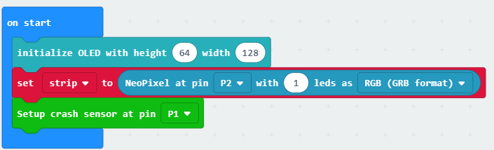
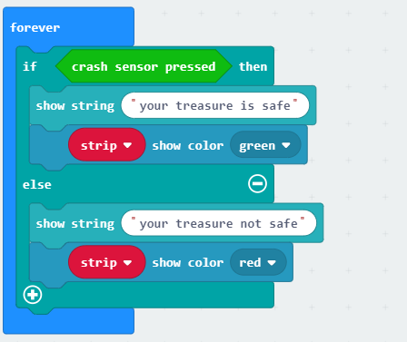

# case 10 simple alarm box

## Our Goal

 Make a simple alarm box.

## Materials

1 x [ELECFREAKS micro:bit Smart Home Kit](https://www.elecfreaks.com/micro-bit-smart-home-kit.html)

## Background

 The crash sensor can deliver a crash signal. When the clips being touched or being relaxed, it will deliver respetiively signal.

### What is a simple alarm box.

 In this project, we are going to create a simple alarm device which will alert the owner if someone has stolen his or her property. The red LED will blink when the crash sensor detects that the object has been taken away. Otherwise, the green LED will light up continuously. The OLED will display the status of the device.

### Pre Build Overview

 The red LED will blink when the crash sensor detects that the object has been taken away. 
 Otherwise, the green LED will light up continuously. The OLED will display the status of the device.

## Practical Operation

 Prepare a scissors, a bottle of glue and a piece of cardboard.
 Set up as below：

Set and stick components as below:

## Hardware Connect

Connect the crash sensor to P1 port of the expansion board;
Connect the rainbow LED to P2 port of the expansion board;

## Software

[makecode](https://makecode.microbit.org/#)
 

## Programming

### Step 1

 Click "Advanced" in the makecode code drawer for more codes.

 We need to add a new codebase for programming of smart home. Finding “Extensions” at the bottom of code block and click it. Then a message box will show up, search “smart home"， and download this new codebase.

***Note:*** If you get a warning telling you some packages will be removed because of incompatibility issues, either follow the prompts or create a new project in the Projects file menu.

### Step 2

First of all, initialize the OLED using blocks in the OLED section as shown in the picture.
Snap the "set to Neopixel" from the Neopixel, set rainbow led of the P2 port to singel light in RGB mode.
And snap the "setup crash sensor" from the Smarthome Libraries and set it to P1 port to detect the press of the crash sensor.

### Step 3

Since there are only two conditions, we need only one ‘else-if’ statement. When the Crash Sensor is pressed, the green Octopus LED will light up. Or else, if no force is applied to the Crash Sensor, the red LED will blink continuously.

### Program

If you don't want to type these code by yourself, you can directly download the whole program from the link below:

Program link：[https://makecode.microbit.org/_HsM6PrRhAA9c](https://makecode.microbit.org/_HsM6PrRhAA9c)

You also could directly download program by visiting website as below:

<iframe style="position:absolute;top:0;left:0;width:100%;height:100%;" src="https://makecode.microbit.org/#pub:_HsM6PrRhAA9c" frameborder="0" sandbox="allow-popups allow-forms allow-scripts allow-same-origin"></iframe>
  

## Succeed!

 We can see the green light illuminates as showed in the picture below. When we take away the book or something else you placed, you can see the red light starts to flash while the green light turned off.

## Think

 Could you use this kit to make a intruder detection ?

## Questions

## More Information   

