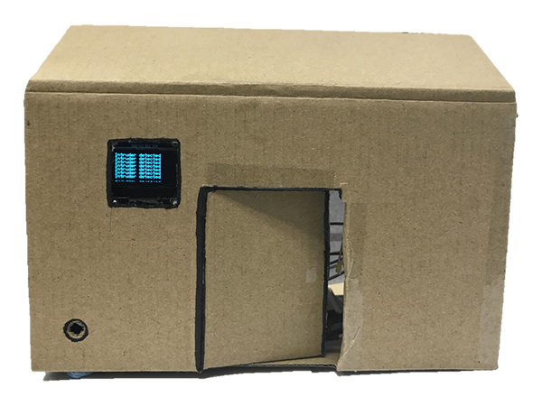
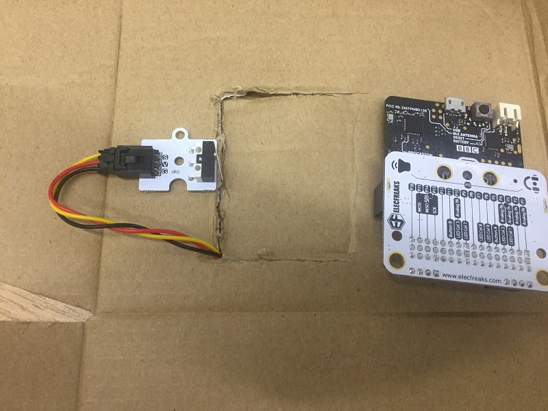
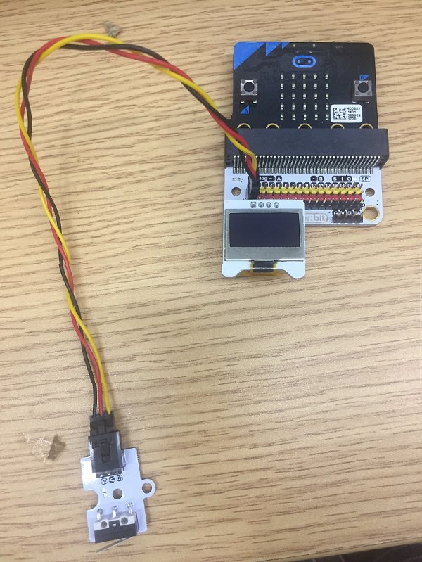
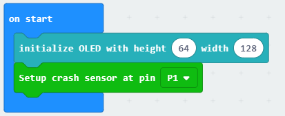
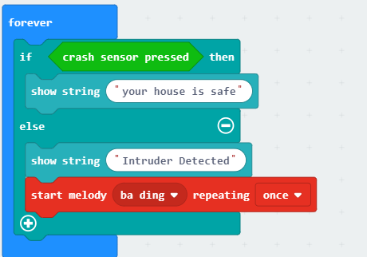

# case 11 intruder detection system

## Our Goal
---

- Make a simple intruder detection system.

## Materials
---

- 1 X Smart Home Kit
- A scissors
- A bottle of glue 
- A piece of cardboard

## Background
---

- The buzzer sounds using a oscillator.

### What is a "intruder detection system" ?

- In this project, we are going to create an intruder detection system which will sound when someone opens the door. The status of the house will be displayed on the OLED.

### Principle of a simple intruder detection 

- The crasher sensor receives crash signal and send the alarm signal to the micro:bit. Then the buzzer will sound and the status of the house will be displayed on the OLED.

## Practical Operation
---

- Prepare a scissors, a bottle of glue and a piece of cardboard.
- Stick the paper you prepared on the cardboard and clip it as you need.

- Set up as below：

The front side：

The back side：

## Hardware Connect
---
Connect the crash sensor to the P1 port of the expansion board.
Plug in the OLED as shown in the picture below. 

## Software
---
[makecode](https://makecode.microbit.org/#)
 

## Programming
---
### Step 1

- Click "Advanced" in the makecode code drawer for more codes.

- We need to add a new codebase for programming of smart home. Finding “Extensions” at the bottom of code block and click it. Then a message box will show up, search “smart home"， and download this new codebase.

***Note:*** If you get a warning telling you some packages will be removed because of incompatibility issues, either follow the prompts or create a new project in the Projects file menu.

### Step 2

- Snap the on start block from Basic, set the P1 port to touch detect port.

### Step 3

- Since there are only two conditions, we need only one “else-if”statement.
When crash sensor is triggered, the buzzer will sound and the OLED will display the message “Intruder Detected”. Or else, if there is no force is applied to the crash sensor, the buzzer will not sound and the OLED will display the message “The house is safe”.

### Program

Program link：[https://makecode.microbit.org/_D6v8RH0dFYk1](https://makecode.microbit.org/_D6v8RH0dFYk1)

You also could directly download program by visiting website as below:

<iframe style="position:absolute;top:0;left:0;width:100%;height:100%;" src="https://makecode.microbit.org/#pub:_D6v8RH0dFYk1" frameborder="0" sandbox="allow-popups allow-forms allow-scripts allow-same-origin"></iframe>
  

## Result
---

-You have created a intruder detector!

## Think
---

- What can you do more with the smart home kit? 

## Questions
---

## More Information 
---

