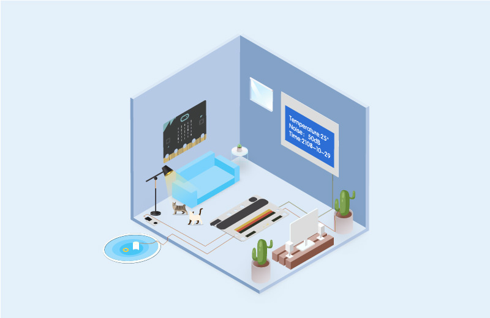
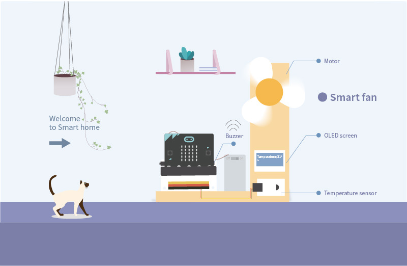

# Introduction

Smart home Kit is a product about smart home project based on micro:bit which is developed by ELECFREAK. We selected executed components commonly used at home as TMP36 temperature sensor, sound sensor, crash sensor, servo, motor. You can build scene like windowsill, wardrobe and fish tank, create yourself smart sweet home and programming to intelligently driving them using micro:bit. 
Smart home is what makes life more practical and playing with it is what makes life more interesting.

## Products Link

[ELECFREAKS micro:bit Smart Home Kit](https://www.elecfreaks.com/micro-bit-smart-home-kit.html)

## Application Scene   

### Smart fan  

### Voice-activatied light 

For more practical case, please refer to the materials. 

## Components

Module | Quantity | Remark
:-: | :-: | :-: 
micro:bit|1|Option
3V sensor:bit|1|
OLED Screen|1|
Crash E-Blocks|1|
TMP36 temperature sensor E-Blocks|1|
Rainbow LED E-Blocks|1|
Simulation noise sensor E-Blocks|1|
Light sensor E-Blocks|1|
Soil moisture sensor E-Blocks|1|
Relay E-Blocks|1|
DC motor E-Blocks|1|
180° servo E-Blocks|1|
Submersible pump E-Blocks|1|
Screw driver|1|
USB Cable|1|
Crystal Battery Box	|1|
Smart home kit manual book|1|

## FAQ

