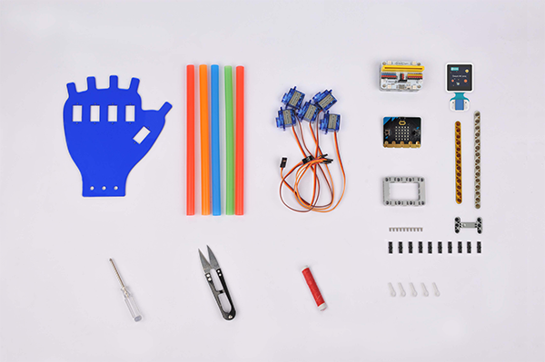
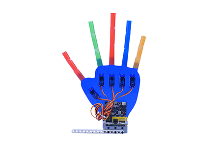
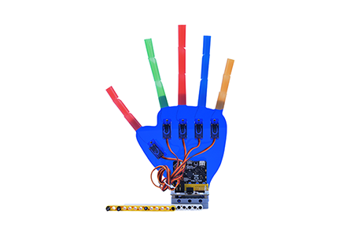
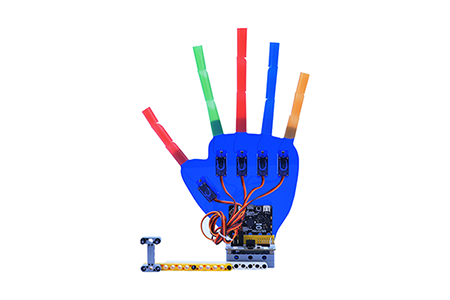
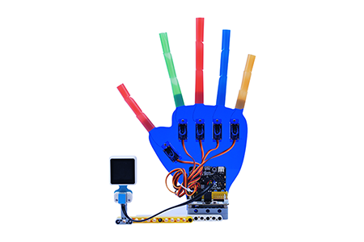

# Control the Wukong Manipulator Kit with the AI Lens

## Products Link

[wukong manipulator kit](https://shop.elecfreaks.com/products/elecfreaks-wukong-manipulator-kit?_pos=2&_sid=5727058f5&_ss=r)
[elecfreaks smart ai lens kit](https://shop.elecfreaks.com/products/elecfreaks-smart-ai-lens-kit?_pos=1&_sid=59be21b59&_ss=r)

## Introduction

In this project we need to use the AI Lens kit and the Wukong Manipulator kit, and the manipulator will make different hand gestures in response to the different colors of the balls that are detected by the AI Lens. 

The AI Lens is able to achieve the functions of face recognition, balls tracking, cards recognition, line tracking, color recognition and characteristics acquisition.

For more information please go to the wiki page of the AI Lens: [AI Lens Kit file](https://elecfreaks.com/learn-en/microbitplanetX/ai/Plant_X_EF05035.html).

## Materials Required

## Assembly

Ⅰ. Assembly of the staws manipulator: 
Please refer to: [Staw manipulator](./How-to-use-the-microbit-to-control-the-straw-manipulator.md)

Ⅱ. Assembly of the AI Lens: 

a. Insert the 3 black pins on the beam frame 5X7 and Install the technic 15M beam as the picture shows

b. Install the technic 13M beam and the black pins as the picture shows. 

c. Install the Modified H-shape Thick 3*5 Perpendiculor as the picture shows. 

d. Connect the AI Lens with cables of the RJ11  connector to Dupont as the picture shows. Note: the connection sequence of the RJ11 cables to Wukong breakout board shall be followed as the picture shows. 

## Programming

Go to  [Makecode](https://makecode.microbit.org) for programming, about the methods to add the wukong expansions and its programming reference, please refer to [Staw manipulator](https://www.elecfreaks.com/learn-cn/microbitKit/straw-manipulator/How-to-use-the-microbit-to-control-the-straw-manipulator.html).

## Initialization

The initial status of this wiki is: 0 degree represents the fully stretching out of the "fingers", 180 degrees represent the "curve" of the "fingers", thus, we need to adjust servo to its 0 degree before programming. Take off the white plate and program as below(or you can download it directly):

Code: 

<iframe style="position:absolute;top:0;left:0;width:100%;height:100%;" src="https://makecode.microbit.org/#pub:_azoXDPMYE35F" frameborder="0" sandbox="allow-popups allow-forms allow-scripts allow-same-origin"></iframe>
 

After adjusting the angel of the servo, install the white plate and run the below code, of course you can program with the other gestures as you wish. 

## Sample

Link: [Control the Wukong Manipulator Kit with the AI Lens](https://makecode.microbit.org/_4qKFUwW2k6jV)

You may also download it directly: 

<iframe style="position:absolute;top:0;left:0;width:100%;height:100%;" src="https://makecode.microbit.org/#pub:_4qKFUwW2k6jV" frameborder="0" sandbox="allow-popups allow-forms allow-scripts allow-same-origin"></iframe>
 

## FAQ

The straw manipulator uses a 180 degree servo, and the value range of the control servo block is: 0~180. After downloading the programmed micro:bit, turn on the power switch of the Wukong expansion board. For details on the use of the [Wukong expansion board](https://www.elecfreaks.com/learn-en/microbitExtensionModule/wukong.html), please refer to its related documentation.
