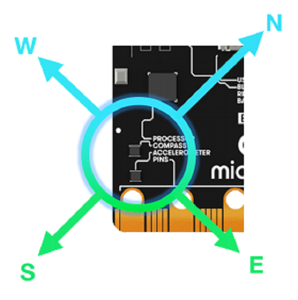
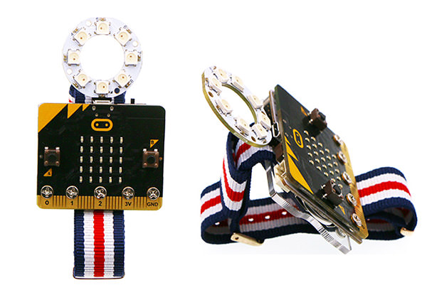
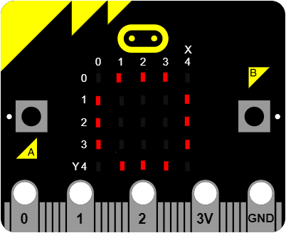
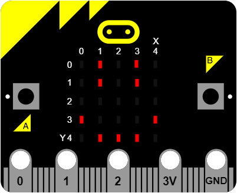
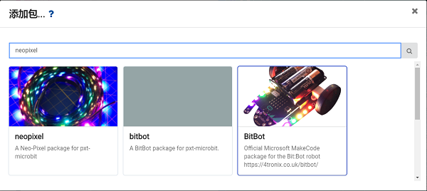
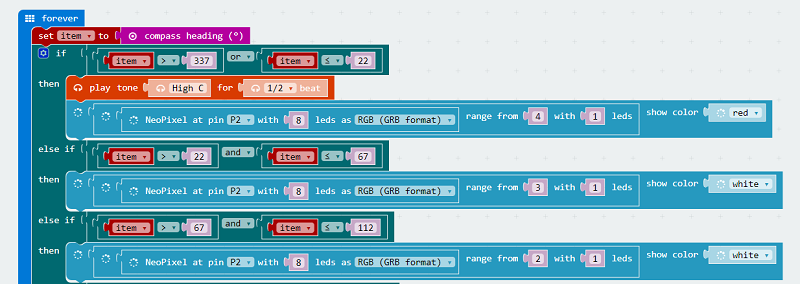
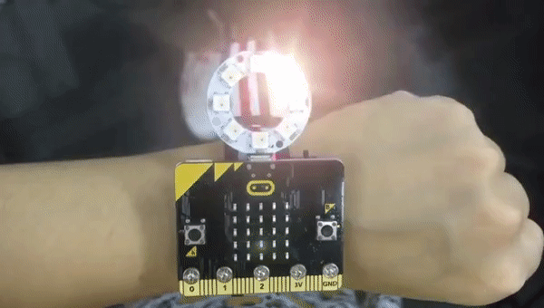

# case 01:Compass

## Our Goal  
---
- Use watch kit to make a portable compass with colorful LED indicators.

## Material  
---
- 1 x Watch kit

## Background Knowledge  
---

### What is compass?   

- [Compass](https://en.wikipedia.org/wiki/Compass)was called Sinan in chinese ancient times. Its major component is a magnetic pin installed on a shaft. The magnetic pin can rotate freely under the effect of the natural magnetic field and maintain in the tangential direction of the magnetic meridian. The north pole of the magnetic pin points to the geographical south pole. We can use this feature to recognise directions.

### micro:bit Compass  

- micro:bit has a compass module that performs the function of compass. When the compass points to the north, the return value is 0, i.e. the return value is increased to 360 in the clockwise direction. We can judge directions according to their return values.

## Hardware Connection  
---
Plug the LED ring into power:bit like the picture below.

## Software  
---
[Microsoft Makecode](https://makecode.microbit.org/#)

- We need to initialize the compass every time before we use it. The initialization is a little game. After lightening a circle on micro:bit LED screen, a smile face will appear to tell you that the initialization is completed.

 

## Programming   
---  
### Step 1  
- Click `Advanced` in the code drawer of MakeCode to see more options.  

- To program for the LED ring, we have to add a package. Find `Add Package`in the bottom of code drawer and click on it. This will pop up a dialogue box. Search for "nexpixel" and then click to download this package.

***Note:*** If you get a hint that some packages will be deleted due to the problem of incompatibility, you can either follow the prompts, or create a new project in the project menu. 

### Step 2  
- Drag a `on start` block from `Basic` and insert it into `calibrate compass` block. This will initialize the compass module on micro:bit.

  

### Step 3  
- Drag a `set to` block and place it under a `forever` block.
- Create a variable item and set it to return value of the compass.
- Because the range of return value is 0-360 and there is 8 beads on LED ring, so we divide 360 degree into 8 section. The range of north direction is from 337 degrees to 22 degrees. It is gradually increasing.
- When pointing to the north, the 5th LED becomes red, while micro:bit is giving a sound prompt. 

### Program  

- Link of the whole program: [https://makecode.microbit.org/_cj1EUmFJH6At](https://makecode.microbit.org/_cj1EUmFJH6At)

- You can also download the whole program from the page below.  

<iframe style="position:absolute;top:0;left:0;width:100%;height:100%;" src="https://makecode.microbit.org/#pub:_cj1EUmFJH6At" frameborder="0" sandbox="allow-popups allow-forms allow-scripts allow-same-origin"></iframe>
  

## Result  
---
- When pointing to the north, the 5th LED becomes red and we can hear a sound prompt from micro:bit.  

  

## Think   
---  

## FAQ  
---  
Q: Why the pointing direction is not fixed every time when we use it?
A: The compass direction is just an approximate direction. It is relative to the result of compass calibration. 

## Relative Readings   
---

