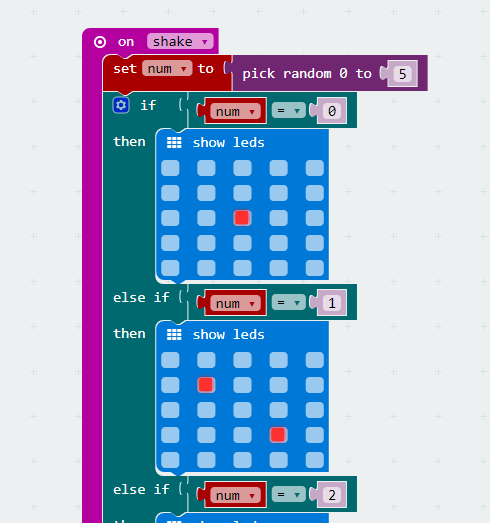

# case 02:Dice

## Our Goal  
---  
- Use watch kit to make a wearable dice.  

## Material Needed  
---  
- 1 x Watch kit

## Hardware Connection  
---  
Asmmble our watch kit directly just like the picture below.  

  

## Software  
---  
[Microsoft Makecode](https://makecode.microbit.org/#)  

## Programming  
---  

### Step 1  

- Drag out an `on shake` block from `input`.  
- Create a variable `num` and assign value to this variable with a random number among 0 to 5.  
- Insert a `if` block. When the random number picked is 0, then display one point. If the random number is 2, then display two points. And so on.

  

### Program  

- The link of the whole program: [https://makecode.microbit.org/_fdYbizRa3VW4](https://makecode.microbit.org/_fdYbizRa3VW4)  

- You can also download the program from the page below.  

<iframe style="position:absolute;top:0;left:0;width:100%;height:100%;" src="https://makecode.microbit.org/#pub:_fdYbizRa3VW4" frameborder="0" sandbox="allow-popups allow-forms allow-scripts allow-same-origin"></iframe>
  

## Result  
---  
- Every time when we shake our micro:bit, a random number is created.  

## Think  
---  

## FAQ  
---  

## Relative Readings  
---  

