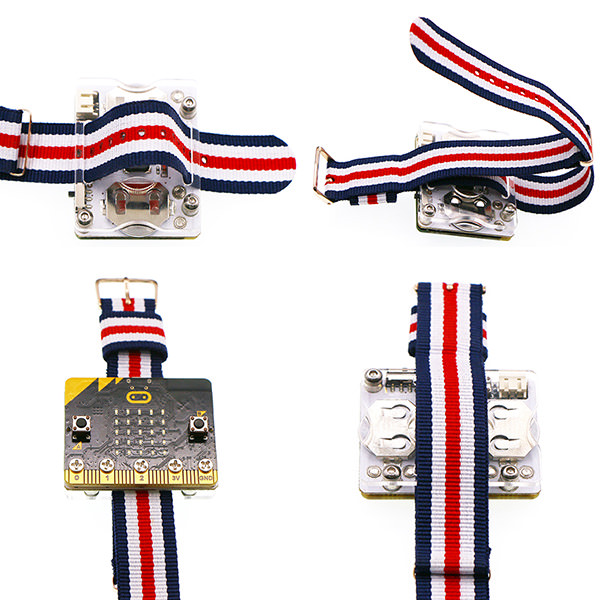
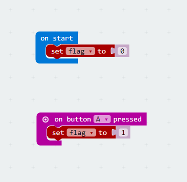
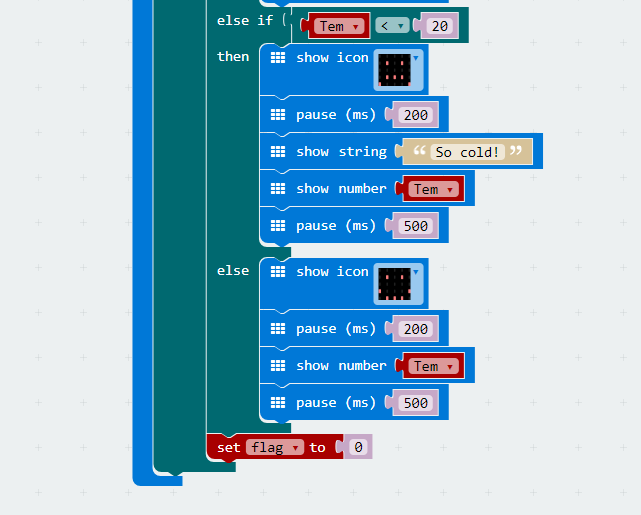
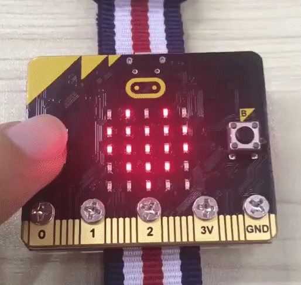

# case 03:Thermometer

## Our Goal  
---  
- Use watch kit to create a wearable thermometer.  

## Material  
---  
- 1 x Watch kit

## Hardware Connection  
---  
Assemble our watch kit directly just like the picture below.   

  

## Software  
---  
[Microsoft Makecode](https://makecode.microbit.org/#)  

## Programming  
---  

### Step 1  

- Create a variable `flag`. Initialize this variable to 0 when we startup our micro:bit. When button A is pressed, set the `flag` to 1.

### Step 2  

- Create a `forever` loop and insert `show icon` block with a heart under it. If the `flag` equals 1, then assign the temperature value to the variable `Tem`.
- If the variable `Tem` is beyond 30 degrees, display a crying face and show string "So Hot"。And then delay 0.5 second after displaying the temperature. 

### Step 3  

- If the variable `Tem` is under 20 degrees, display a crying face and show string "So cold". And then delay 0.5 second after displaying the temperature. 
- If the temperature is among 20 degrees to 30 degrees, then display a smile face and delay for 0.5 second after showing the temperature. 
- Set `flag`to 0 to exit the function above. 

## Program   
---
- The link of whole program: [https://makecode.microbit.org/_iHY0ReVrTJJX](https://makecode.microbit.org/_iHY0ReVrTJJX)

- You can also download the program from the page below.

<iframe style="position:absolute;top:0;left:0;width:100%;height:100%;" src="https://makecode.microbit.org/#pub:_iHY0ReVrTJJX" frameborder="0" sandbox="allow-popups allow-forms allow-scripts allow-same-origin"></iframe>
  
---

## Result  
---
- We can see a smile face and temperature on micro:bit screen.

## Think    
---  

## FAQ  
---  
Q: Sometimes the temperature is obviously under 20 degrees, why the displayed  number is much higher? 
A: Because the temperature obtained by micro:bit is the temperature of main chip, instead of environment temperature. When micro:bit runs for a long time, the chip will be heated significantly.

## Relative Readings   
---  

