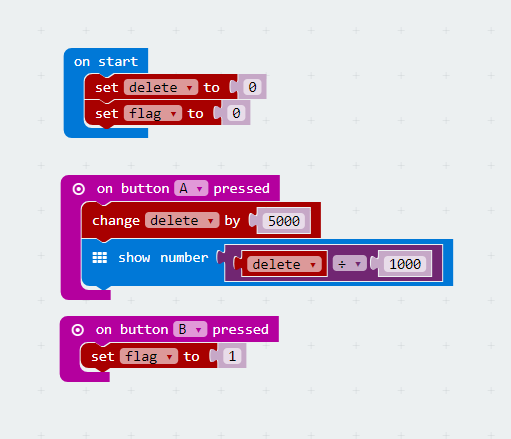
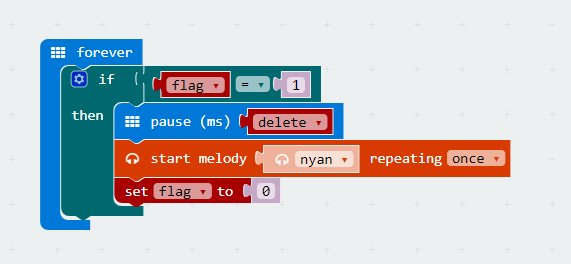

# case 04:Timer

## Our Goal  
---  
- Use our watch kit to create a wearable timer.  

## Material   
---  
- 1 x Watch kit

## Hardware Connection  
---  
Assemble our watch kit directly just like the picture below.  

  

## Software  
---  
[Microsoft Makecode](https://makecode.microbit.org/#)  

## Programming  
---  
### Step 1  

- When start our program, create a variable `flag` and set its value to 0. When button A is pressed, delay time for 5 second. When button B is pressed, set the value of variable `flag` to 1.  

### Step 2

- Create a `forever` loop and place an if statement under it. When the variable `flag` equals to 1, then activate the function. 
- Set time delay and play the built-in music `nyan` for once. Then set the variable `flag` to 0.

  

### Program  
- Link of the whole program: [https://makecode.microbit.org/_35iVK1WVe8ms](https://makecode.microbit.org/_35iVK1WVe8ms)

- You can also download the program from the page below.  

<iframe style="position:absolute;top:0;left:0;width:100%;height:100%;" src="https://makecode.microbit.org/#pub:_35iVK1WVe8ms" frameborder="0" sandbox="allow-popups allow-forms allow-scripts allow-same-origin"></iframe>
  

## Result  
---  
- The watch can keep time precisely and play music.  

## Think  
---  

## FAQ  
---  

## Relative Readings  
---
  
