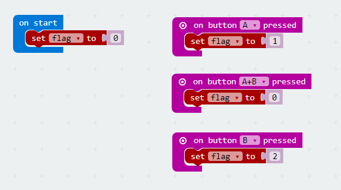
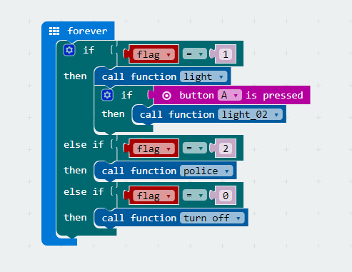
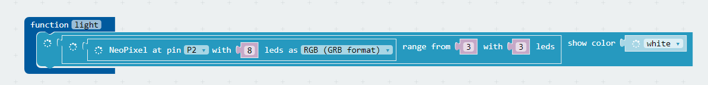
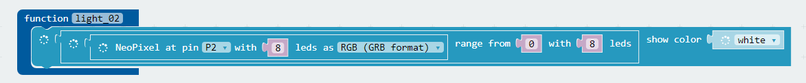
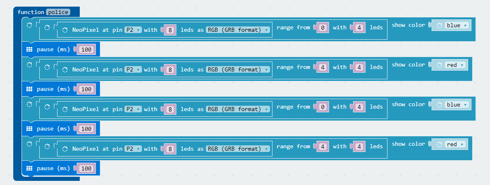
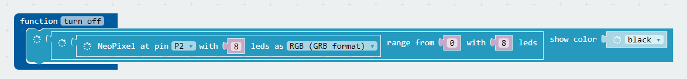
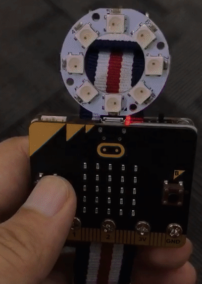

# case 05:Flashlight

## Our Goal  
---  
- Use watch kit to create a wearable flashlight.  

## Material   
---  
- 1 x Watch kit

## Hardware Connection  
---  
Plug the LED ring into power:bit just like the picture below.  

  

## Software  
---  
[Microsoft Makecode](https://makecode.microbit.org/#)  

## Programming  
---  
### Step 1
- Click `Advanced` in the code drawer of MakeCode to see more options.   

  

- To program for the LED ring, we have to add a package. Find `Add Package` in the bottom of code drawer and click it. This will pop up a dialogue box. Search for "neopixel" and click to download this package. 

  

***Note:*** If you get a hint that some packages will be deleted due to the problem of incompatibility, you can either follow the prompts, or create a new project in the project menu.

### Step 2  

- When start our program, create a variable `flag` and set its value to 0.  
- When button A is pressed, set the value of the variable `flag` to 1.   
- When button B is pressed, set the value of the variable `flag` to 2.   
- When button "A+B" is pressed, set the value of the variable `flag` to 0.   

  

### Step 3  

- Create a forever loop to continuously judge if statements.   
- When `flag` equals to 1，call function `light`(turn on 3 LEDs); when `flag` equals to 1 and button A is pressed, call function `light_02`(All LEDs turned on).
- When `flag` equals to 2，call function `police`(simulate alarm light).  
- When `flag` equals to 0，call function `true off` to turn off all LEDs.  

  

### Step 4  

- Function `light` allows 8 LEDs connected to P2 port and turns on the LED number 4~6 with white light.  

  

- Function `light_02` will turn on all LEDs.   

  

- Function `police` allows number 0~4 LEDs become blue and number 4~8 LEDs become red. Each section delays for 0.1 second.   

  

- Function `true off` will turn off all LEDs.  

  

### Program  
- Link of the whole program: [https://makecode.microbit.org/_goJVKXdyqVRX](https://makecode.microbit.org/_goJVKXdyqVRX)  

- You can also download the program from the page below.  

<iframe style="position:absolute;top:0;left:0;width:100%;height:100%;" src="https://makecode.microbit.org/#pub:_goJVKXdyqVRX" frameborder="0" sandbox="allow-popups allow-forms allow-scripts allow-same-origin"></iframe>
  

## Result  
---
Press button A, all LEDs on LED ring are turned on.   
Press button B, LEDs are flashing.   
Press button A+B, all LEDs are turned off.   

  

## Think  
---  

## FAQ  
---
Q: Why the LED light looks yellow while in the code it is white?  
A: Due to the insufficient battery power, the current can't support to drive the LED ring.  

## Relative Readings  
---
