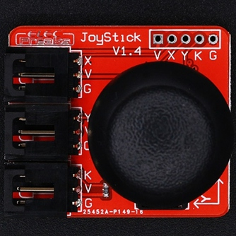
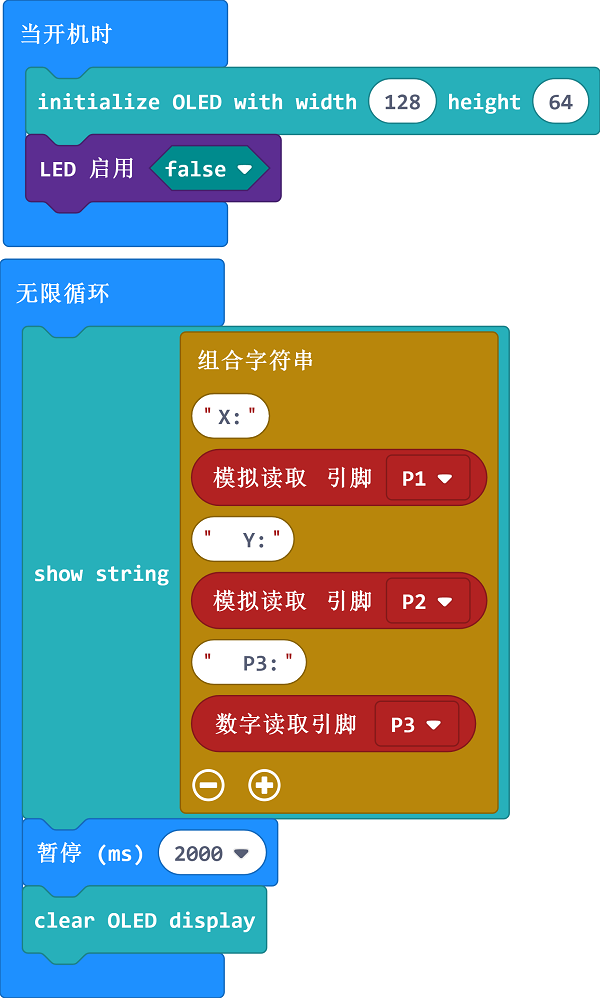

# Joystick breakout module BKOUT_MD01(EF03055)

## Introduction

## Characteristics

 Standard 3pin GVS port is easy to plug. 
 Support driving micro:bit in 3V.

## Specifications

Item | Parameter 
:-: | :-: 
SKU|EF03055
Power Supply|3V5.5V
Connections Type|Analog
Pins Definition|1Signal 2VCC 3GND
Response|Quick response with high sensitivity
Circuit|Simple
Stability|Stable and durable

## Outlook and Dimensions

## Quick to Start 

### Materials Required and Connection Diagram

### Add Package

Click "Advanced" to see more choices in the MakeCode drawer. 

Click "Extensions" to search "IoT" in the dialogue box and then download it. 

### Programme as the picture shows
 The current status of the joystick shows on the OLED screen.  

### Reference
Link：[https://makecode.microbit.org/_gHmP4DJVYXtA](https://makecode.microbit.org/_gHmP4DJVYXtA)
You can also download it below directly:

<iframe style="position:absolute;top:0;left:0;width:100%;height:100%;" src="https://makecode.microbit.org/#pub:_gHmP4DJVYXtA" frameborder="0" sandbox="allowpopups allowforms allowscripts allowsameorigin"></iframe>
  

### Result
 The current status of the joystick shows on the OLED screen.  

## Relevant Cases

## Technique Files

