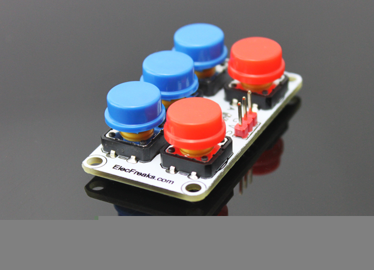
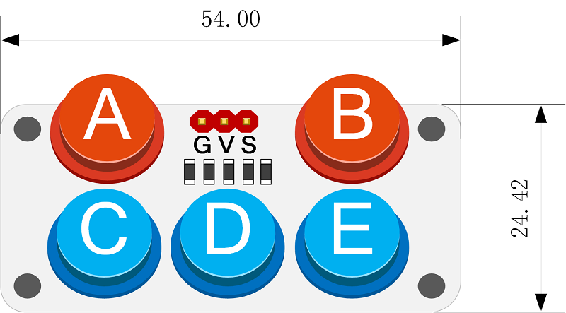
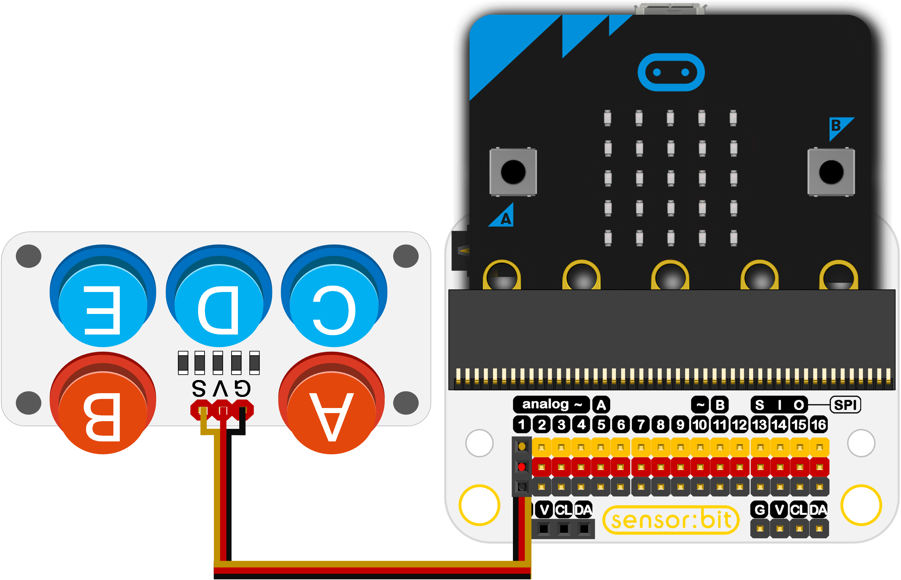
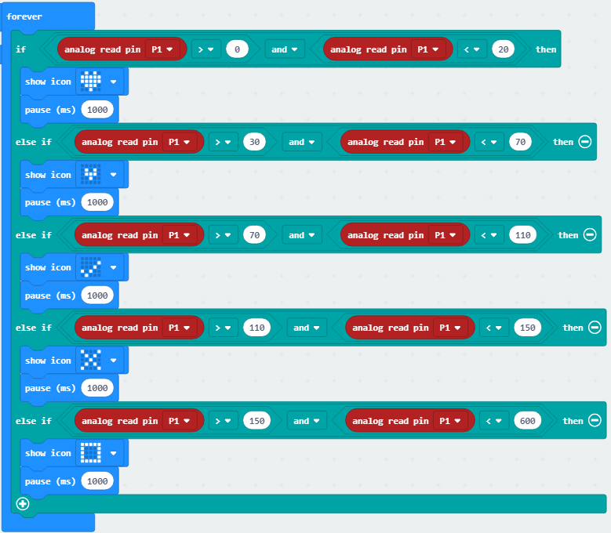

# Octopus ADKeypad(EF04017)

## Introduction
---

- This keyboard uses an analog input to read the five key state with one IO port. 
- It can achieve many amazing interactive projects.

 

## Characteristics
---
- The 3-pins ports is easy to plug and play..
- It can work with micro:bit in 3V. 

## Specifications
---

Item | Parameter 
:-: | :-: 
SKU|EF04017
   Power Input   |3V-5V
Connector Type|Analog
Pins Definition|1-Signal 2-VCC 3-GND
    Response     |Quick to response with high sensitivity
Circuit|Simple
Stability|Stable and durable

## Outlook and Dimensions
---
 

## Quick to Start
---
### Connection diagram
- Connect to P1 port as the picture shows.

Take sensor:bit for example

### Program as the picture shows
- Analog read the returned value.
- When returned value is between 0~20, it means the button A is pressed, an icon is shown on the micro:bit.
- By parity of reasoning.

 

### Reference

Links:[https://makecode.microbit.org/_dqjTtAM5sfmy](https://makecode.microbit.org/_dqjTtAM5sfmy)

You can also download it directly below:

<iframe style="position:absolute;top:0;left:0;width:100%;height:100%;" src="https://makecode.microbit.org/#pub:_dqjTtAM5sfmy" frameborder="0" sandbox="allow-popups allow-forms allow-scripts allow-same-origin"></iframe>
  

### Result
- Press different buttons on the ADKeypad, different graphs show on the micro:bit.

## Relevant Cases 
---

## Technique Files
---
