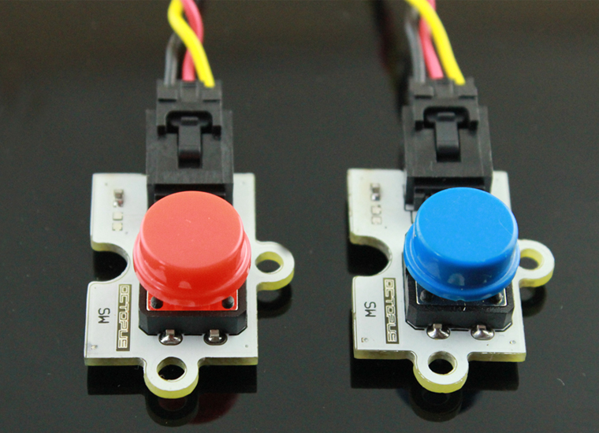
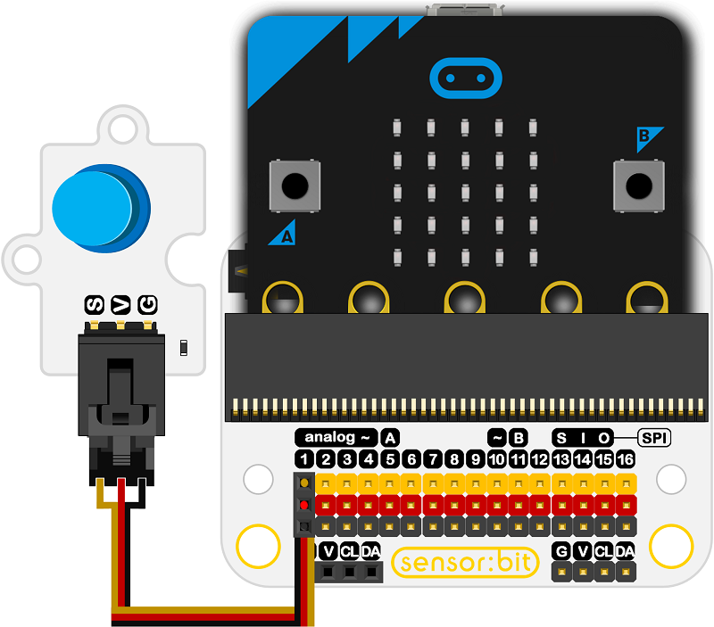
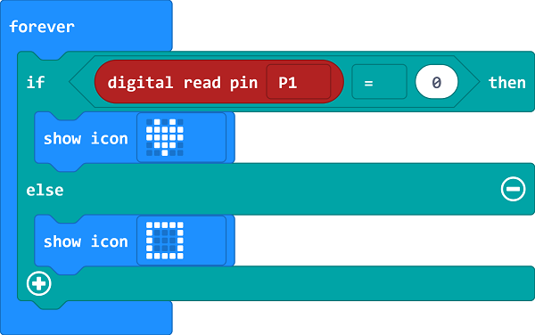

# OBPushButton - Blue

## Introduction
---
 This is a digital push button sensor, which detects your press action and it is ideal for beginners to use.

 

## Characteristics
---
- The 3-pins ports is easy to plug and play.
- It can work with micro:bit in 3V. 

## Specifications
---
Item | Parameter 
:-: | :-: 
SKU|EF04034
Power Supply|3V-5.5V
Connector Type|Analog
Pins Definition|1-Signal 2-VCC 3-GND
    Response     |Quick response with high sensitivity
Circuit|Simple
Stability|Stable and durable

## Outlook and Dimension
---

 

## Quick to Start
---

### Materials used and connection diagram

- Connect to the P1 port as the picture shows

  Take sensor:bit for example

 

### Program as the picture shows

 

### Reference

Links: [https://makecode.microbit.org/_WhpgVrc8sPCM](https://makecode.microbit.org/_WhpgVrc8sPCM)

You can also download the links below:

<iframe style="position:absolute;top:0;left:0;width:100%;height:100%;" src="https://makecode.microbit.org/#pub:_WhpgVrc8sPCM" frameborder="0" sandbox="allow-popups allow-forms allow-scripts allow-same-origin"></iframe>
  
---

### Result
- While the button being pressed, an icon is showing on the micro:bit; while released, a rectangle is showing on the micro:bit.

## Relevant Cases
---

## Technique Files
---
