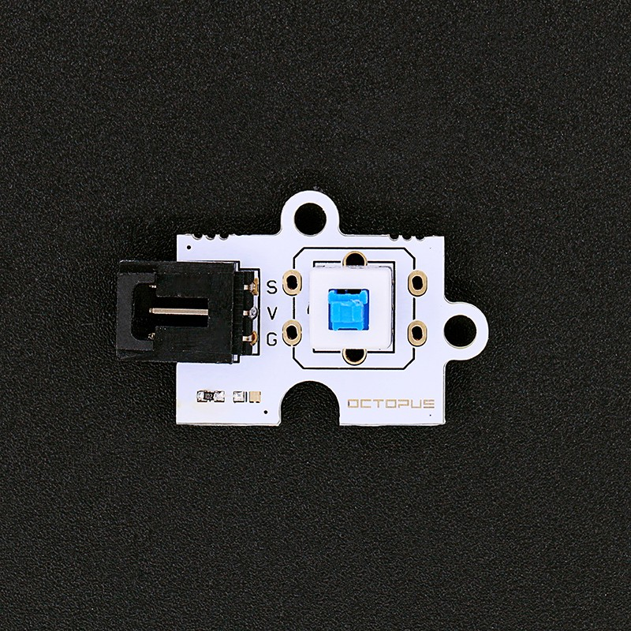
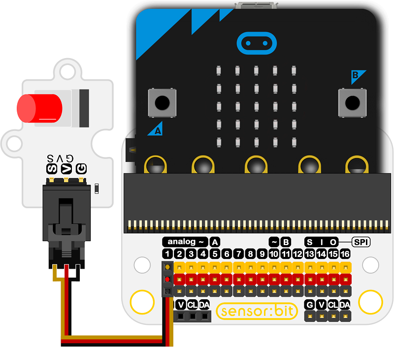
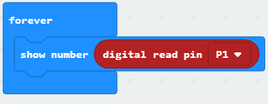

# Octopus Push Lock E-Switch Brick OBPLock(EF04035)

## Introduction
---
This is Push Lock E-Switch button brick, which detects your press action and it is ideal for beginners to learn.

 

## Characteristics
---
- It is easy to plug and play.

## Specifications
---

Item | Parameter 
:-: | :-: 
SKU|EF04035
Power Dissipation|ULP
Working Temperature|-20-70℃
Working Voltage|3.3-5V

## Outlook and Dimensions
---
 

## Quick to Start
---

### Materials used and connection diagram

- Connect to the P1 port as the picture shows

  Take sensor:bit for example

### Add Package

Program as the picture shows

### Reference

Links: [https://makecode.microbit.org/_8pkVmHELdVHd](https://makecode.microbit.org/_8pkVmHELdVHd)

You can also download the links below:

<iframe style="position:absolute;top:0;left:0;width:100%;height:100%;" src="https://makecode.microbit.org/#pub:_8pkVmHELdVHd" frameborder="0" sandbox="allow-popups allow-forms allow-scripts allow-same-origin"></iframe>
  

### Result
- While the button being pressed, the status of the sensor button is showing on the micro:bit in number: 0 or 1.

## Relevant Cases
---

## Technique Files
---
