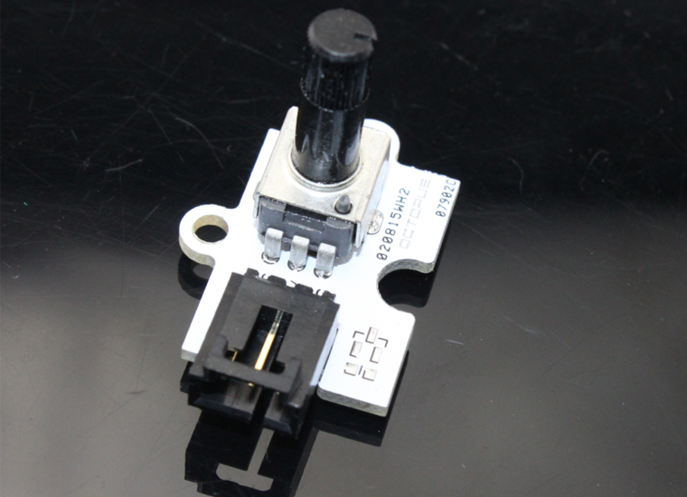
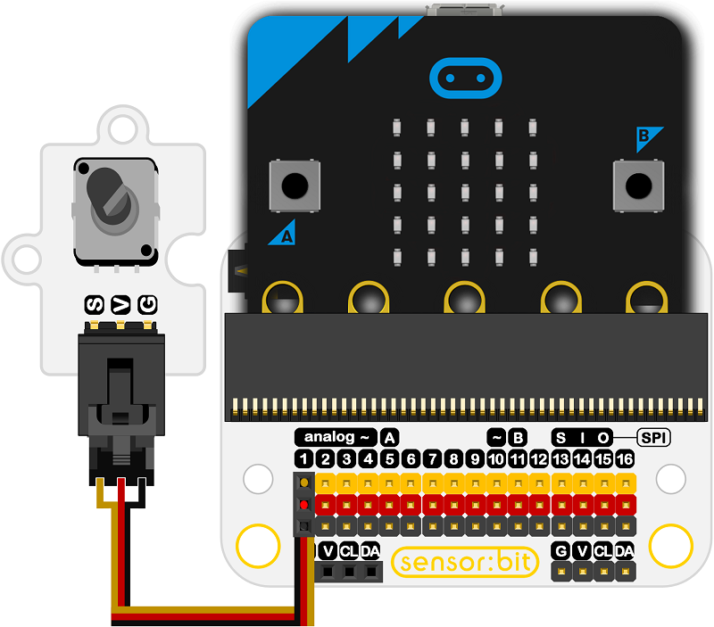

# Octopus Analog Rotation Brick OBARot(EF04041)

## Introduction
---
Octopus Analog Rotation Brick is micro:bit compatible and can be rotated up to 300-degree. It is based on the potentiometer. 

 

## Characteristics
---
- The 3-pins ports is easy to plug and play.

## Specifications
---

Item | Parameter 
:-: | :-: 
SKU|04041
Power Supply|3.3V~5.5V
Connector Type|Analog
Pins Definition|S-Sigal V-VCC G-GND
Response|Quick response with high sensitivity
Rotate Angel|300 degrees
Size|19x27mm

## Outlook and Dimensions
---

 

## Quick to Start
---

### Materials used and connection diagram

- Connect to the P1 port as the picture shows

  Take sensor:bit for example

 

### Add Package

### Program as the picture shows
Use the brick in the led below, then a sector diagram comes out.

 

### Reference
Links:[https://makecode.microbit.org/_2hr1UMdcp0uj](https://makecode.microbit.org/_2hr1UMdcp0uj)

You can also download the links below:

<iframe style="position:absolute;top:0;left:0;width:100%;height:100%;" src="https://makecode.microbit.org/#pub:_2hr1UMdcp0uj" frameborder="0" sandbox="allow-popups allow-forms allow-scripts allow-same-origin"></iframe>
  

### Result
- Rotate the button on the sensor clock-wisely, then the led on the micro:bit lights on gradually; Oppositely, the led lights off one by one.

## Relevant Cases
---

## Technique Files
---
