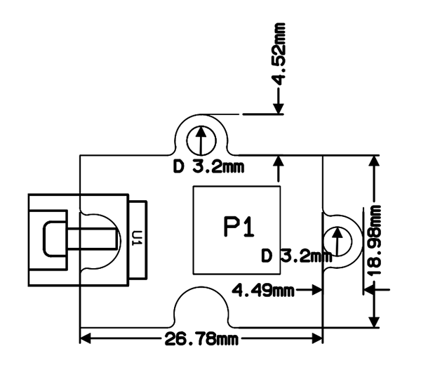
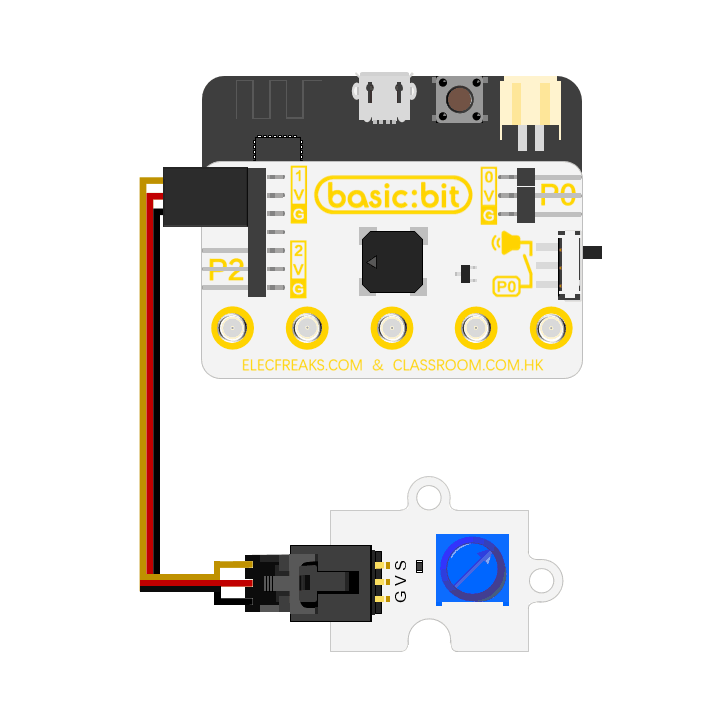

# Analog Rotation Brick(EF04085)

## Introduction

Octopus analog rotation brick is a 10K potentiometer module. Rotating the knob to change its resistance can realize voltage division, and can provide analog signals to the analog input IO ports of microcontroller. This module has a 3wire antireverse connector, which makes it easy to connect a GVS cable. 

## Products Link

[ELECFREAKS Octopus Analog Rotation Brick-Blue](https://www.elecfreaks.com/octopus-analog-rotation-brick-blue.html)

## Characteristics

 Adopting 3 pins cable with antiplug function.
 No screwdriver need, the resistor can be adjusted with hand.
 Compact design.

## Specifications

Item | Parameter 
:-: | :-: 
Name|Octopus analog rotation brick
SKU|EF04085
Resistor Scope|010K
Working Voltage|DC 2.75.5V
Connector|Antiplug GVS
Size|See picture below
NW|3.5g

### Dimension

## Quick to Start

### Hardware Connection
Connect  to P1 port.(See below picture)

### Software Programme
Click to open [Makecode](https://makecode.microbit.org/), write your code to control micro:bit LED screen with octopus analog rotation brick.

Links: [https://makecode.microbit.org/_8FFaqMHP34Vj](https://makecode.microbit.org/_8FFaqMHP34Vj)

You can also download the links below:

<iframe style="position:absolute;top:0;left:0;width:100%;height:100%;" src="https://makecode.microbit.org/#pub:_8FFaqMHP34Vj" frameborder="0" sandbox="allowpopups allowforms allowscripts allowsameorigin"></iframe>

### Result
Rotate the knob of octopus analog rotation brick, then its analog input value will be displayed on micro:bit in the form of bar graph.

## FAQ

