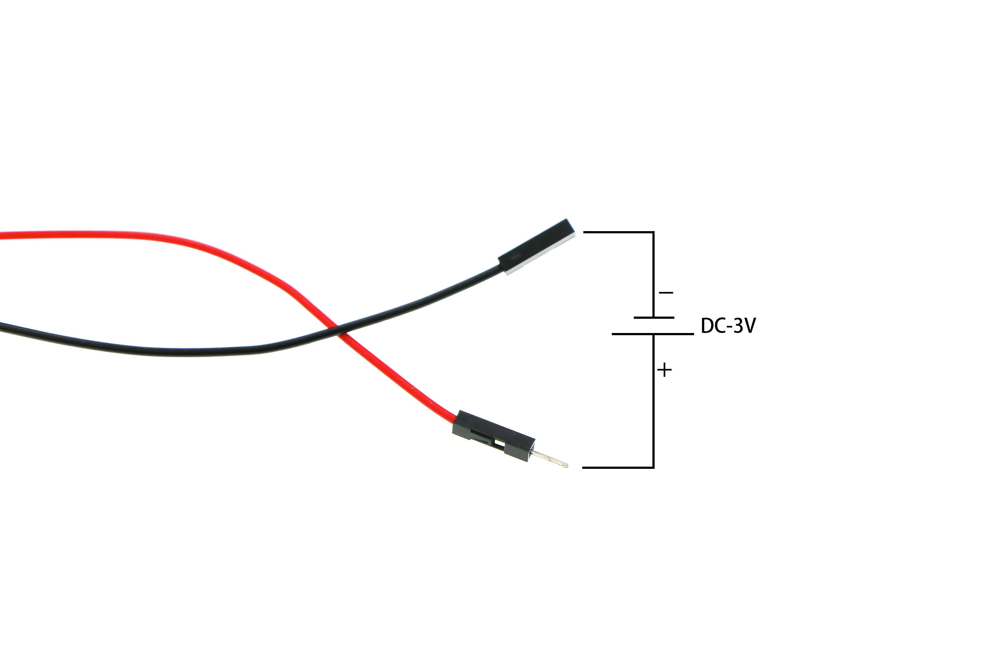

# 3V vertical water pump(EF11098)

## Introduction
---
3V Vertical water pump is a kind of DC micro submersible pump. Equipped with male and female  Dupont line connectors, it can apply to the fountain used in many situations with much convenience. 

## Characteristics 
---
- With low noise and good performance.
- Made by engineering plastics to protect it from exploring.
- Small and easy to install.

## Parameter
---

Item | Parameter 
:-: | :-: 
Name| 3V vertical water pump
Version|V1.0
SKU|EF11098
Operating Voltage|DC 3~4.5V
Operating Method|Submersible Type
Operating Life|200 hours plus
Head of Delivery|0.3~0.8 meters
Water Inlet Diameter|5 mm
Water Outlet Diameter|4.5 mm
Net Weight|28 g

## Quick Start  
---

### Operating Method 

Put the water outlet into the water pipe , connect the power of the pump and the ground wire with 3V DC power, then put the pump into the water and it starts to work by drawing water or drawing off water after switching on. 

## FAQ
---
