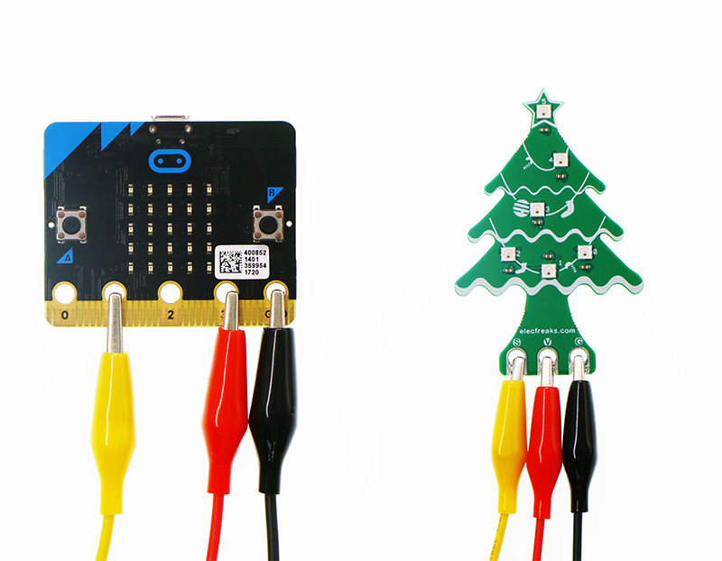
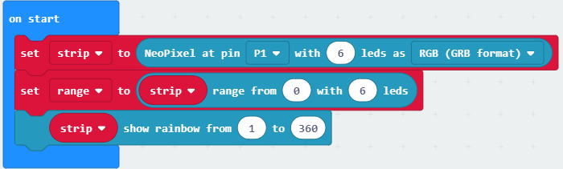
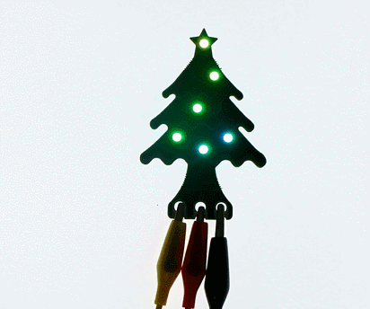

# Christmas Tree Rainbow LED for micro:bit(EF03420)

## Introduction
---
 The christmas tree rainbow LED, with 6 coding LEDs，can help you to decorate a beautiful chritmas night.

## Features
---
- In christmas tree shape, adapt to the christmas scene
- With coding rainbow LED for any colour you like.
- With crocodile clip lines, no need for a expansion board

## Parameters
---

|Items|Parameters|
|:-:|:-:|
|Name|Christmas Tree Rainbow LED|
|SKU| EF03420|
|Input Voltage|DC 3.3~5.0V|
|Size|75.93mm X 50.00mm|
|Net Weight|6.5g|

## Quick Start  
---

### Preparation
- 1 x Chritmas Tree Rainbow LED
- 3 x crocodile clip lines（Please prepare by yourself）
- 1 x micro:bit（Please prepare by yourself）

### Hardware Connect   
- Connect the black crocodile clip line to the GND port of the micro:bit, the other side of the black crocodile clip line to the G port of the christmas tree rainbow LED.
- Connect the red crocodile clip line to the 3V port of the micro:bit, the other side of the red crocodile clip line to the V port of the christmas tree rainbow LED.
- Connect the yellow crocodile clip line to the 0 port of the micro:bit, the other side of the yellow crocodile clip line to the S port of the christmas tree rainbow LED.

### Software  
#### Step 1

- Click [makecode https://makecode.microbit.org/#](https://makecode.microbit.org/#)

- Click on "New Project" and set a new Project.

- Click on "Advanced" for more code blocks and click the Extensions at the bottom of the column.

- Serch "neopixel" and add neopixel as a codebase.

#### Step 2

- Snap "set strip to RainbowLED at pin with leds as" from RainbowLED into the on start. Set pin to P1 with 6 LEDs in RGB pattern.

#### Step 3

- Snap the strip rotate block from the RainbowLED under the forever. Set the rotate pixels to 1 and set the LEDs change its colour one by one.
- Then, snap a strip show block for colourful light. 

### Program

Program link：[https://makecode.microbit.org/_Ukp8C5M2dbr2](https://makecode.microbit.org/_Ukp8C5M2dbr2)

You also could directly download program by visiting website as below:

<iframe style="position:absolute;top:0;left:0;width:100%;height:100%;" src="https://makecode.microbit.org/#pub:_Ukp8C5M2dbr2" frameborder="0" sandbox="allow-popups allow-forms allow-scripts allow-same-origin"></iframe>

### Result 

The christmas tree rainbow LED glows colourful light to bring beauty to the christmas night.

## FAQ
---
