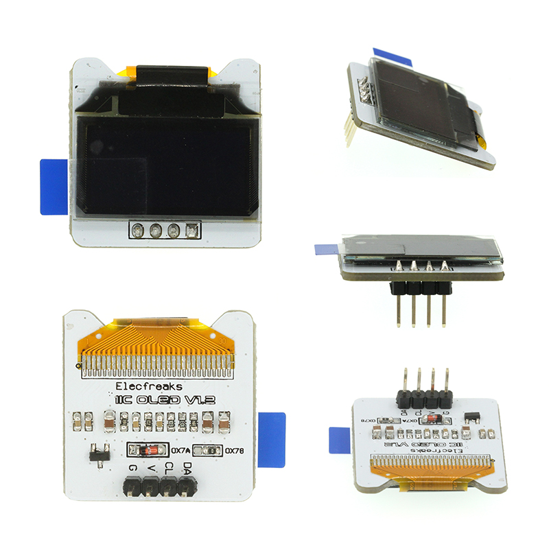
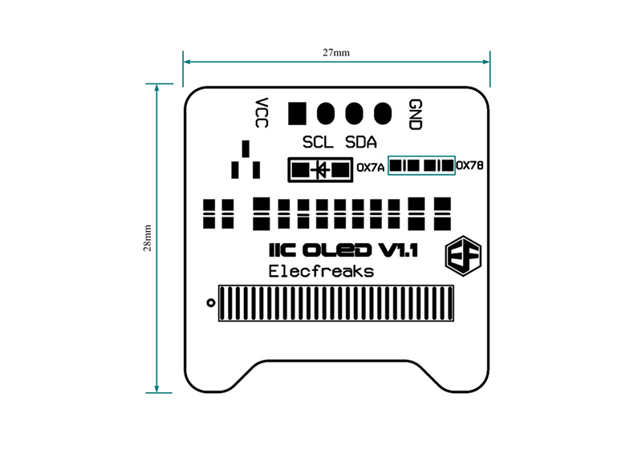
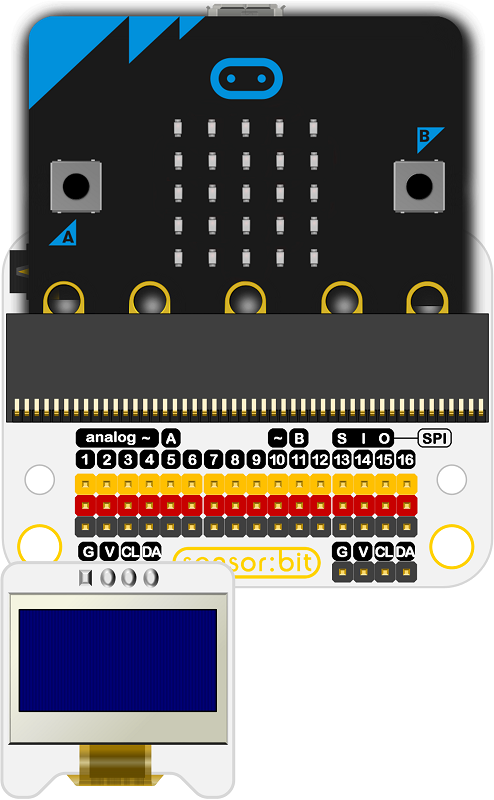
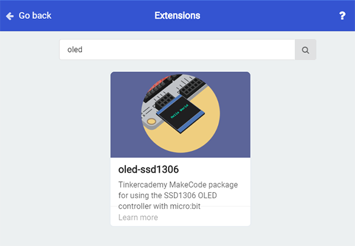
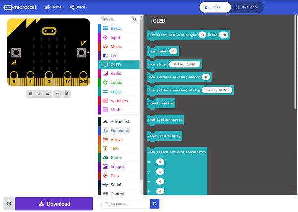
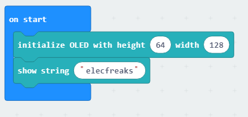
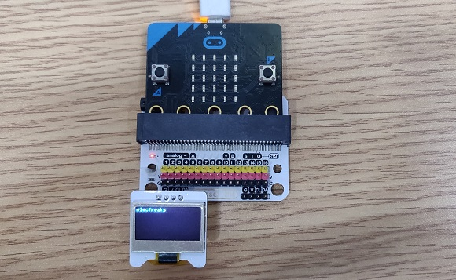

# IIC OLED Module(EF03155)

## Introduction

 This is an OLED display to show the data you want to print.(Chinese is not supported)

 

## Products Link

[ELECFREAKS IIC OLED Module](https://www.elecfreaks.com/iic-oled-module.html)

## Characteristics

 This is a mini OLED display whose diameter is only 1 inch, it is of high resolution due to the  high contrast of the display.
 The display is made of 128x64 white OLED pixels with each on/off by the controlling chip.
 The mini and smart OLED display is of strong  readability due to its high contrast.
 The display does not require backlight selfillumination, it lowers the power for the OLED display to work.
 The loaded voltage regulator and the builtin boost converter made it possible to connect the power in 5V. It is easy to connect to the mini controller in 3V/5V power without any level translator. 

## Specifications

Item | Parameter 
:-: | :-: 
SKU|EF03155
OLED selfillumination|No Backlight
Screen Size | 0.96
Resolution|128×64
Color|Blue
Communication Mode|IIC
Power dissipation|ULP
Working Temperature|2070℃
Working Voltage|3.35V
Dimension|27mm * 28mm

## Dimension

 

## Quick to start

### Connection diagram
 CL pin connect to CL pin; SA to DA; V to V; G to G.

Take sensor:bit for example:

 

###  Add package
 Click "Advanced"in the choice of the MakeCode to find more choices.

 

 Click "Extensions", search "oled"in the dialog box and then download oledssd1306.

 

 

### Program as the picture shows.
 Initialize the pixels of the OLED screen as 64*128.
 Show characters: "elecfreaks"

 

### Reference

Links:https://makecode.microbit.org/_iEs0aXHMh011

You can also download the links below:

<iframe style="position:absolute;top:0;left:0;width:100%;height:100%;" src="https://makecode.microbit.org/#pub:_iEs0aXHMh011" frameborder="0" sandbox="allowpopups allowforms allowscripts allowsameorigin"></iframe>
  

### Result
 "elecfreaks" is displayed on the screen.

 

## Relevant cases

## Technique Files

