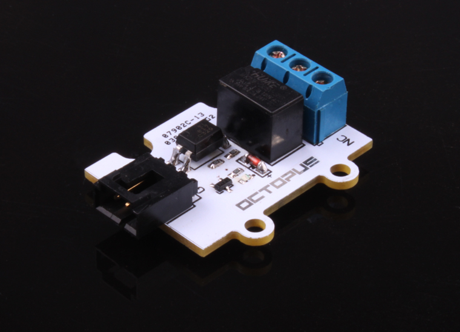
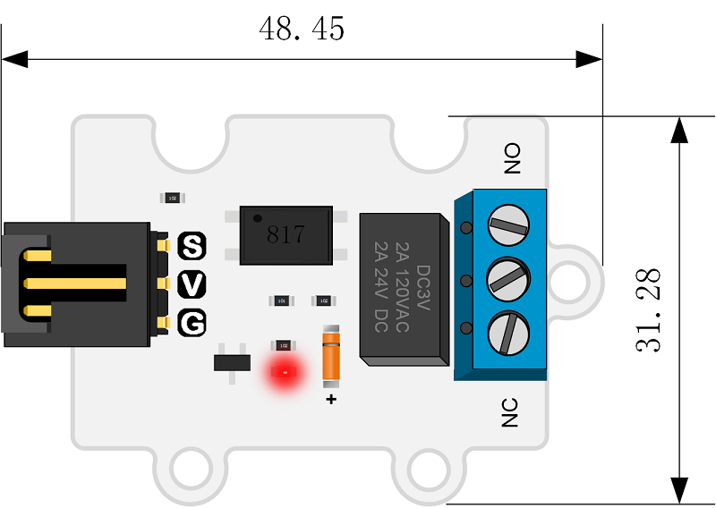
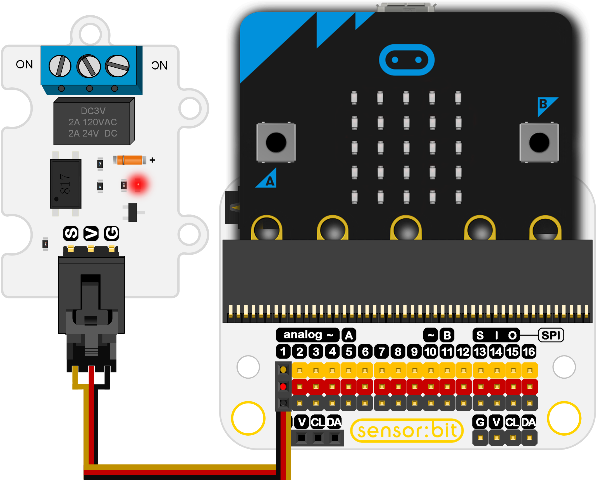
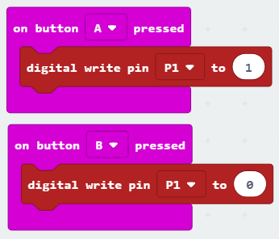

# OCTOPUS 1Channel Relay  5V(EF04026)

##  Introduction

OCTOPUS 1Channel Relay is a single relay electronic brick.

 

## Products Link

[ELEFREAKS Octopus 1 Channel Relay](https://shop.elecfreaks.com/products/elefreaks-octopus-1-channel-relay?_pos=1&_sid=c157bbf49&_ss=r)

## Characteristics

 The 3-pins ports is easy to plug and play.
 It can work with micro:bit in 3V. 

## Specifications

Item | Parameter 
:-: | :-: 
SKU|EF04026
Relay Supply Voltage|3V-5.5V
  Contactor Control   |Light separation circuit
Drive Circuit|Transistor drives circuit, high resistance of the pins
Heavy Relay|DC 24V 2A，AC 120V 2A
PCB location hole|Standard 3mm

## Outlook and Dimensions

 

## Quick to Start

### Materials used and connection diagram

 Connect to the P1 port as the picture shows

  Take sensor:bit for example

 

### Program as the picture shows

 

### Reference

Links: [https://makecode.microbit.org/_5fRVFCVFUJmE](https://makecode.microbit.org/_5fRVFCVFUJmE)

You can also download the links below:

<iframe style="position:absolute;top:0;left:0;width:100%;height:100%;" src="https://makecode.microbit.org/#pub:_5fRVFCVFUJmE" frameborder="0" sandbox="allow-popups allow-forms allow-scripts allow-same-origin"></iframe>
  

### Result
 Press the button A or B to control the on or off of the relay.

## Relevant Cases

## Technique Files

