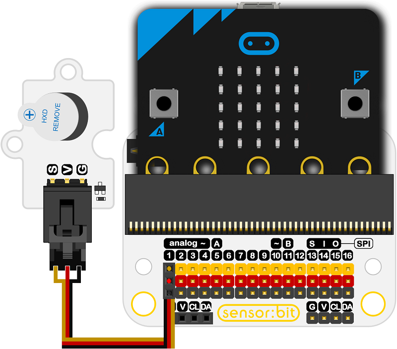

# Octopus Active Buzzer Brick OBAB02

## Introduction
---
Octopus Active Buzzer Brick is based on an active buzzer with a constant volume but can not be controlled  by PWM. 

 

## Characteristics
---
- The 3-pins ports is easy to plug and play.

## Specifications
---
Item | Parameter 
:-: | :-: 
SKU|EF04030
Power Supply|3V-5V
 Connector Type  |Analog
 Pins Definition |S-Sigal V-VCC G-GND
Detection Scope|Large
Response|Quick
Sensitivity|High
Circuit|Simple
Service Life|Long(Stable and durable)
Size|19x27mm

## Outlook and Dimensions
---

## Quick to Start
---
### Materials used and connection diagram

- Connect to the P1 port as the picture shows

  Take sensor:bit for example

### Add Package

### Program as the picture shows

### Reference
Links: [https://makecode.microbit.org/_3KMCFREjmbYx](https://makecode.microbit.org/_3KMCFREjmbYx)

You can also download the links below:

<iframe style="position:absolute;top:0;left:0;width:100%;height:100%;" src="https://makecode.microbit.org/#pub:_3KMCFREjmbYx" frameborder="0" sandbox="allow-popups allow-forms allow-scripts allow-same-origin"></iframe>
  
---

### Result
- The buzzer gives off a continuous beeping sound.

## Relevant Cases
---

## Technique Files
---
