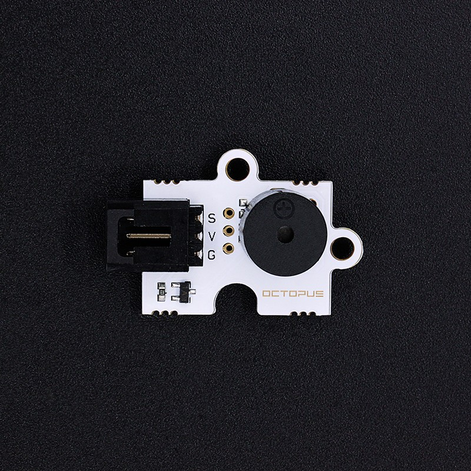
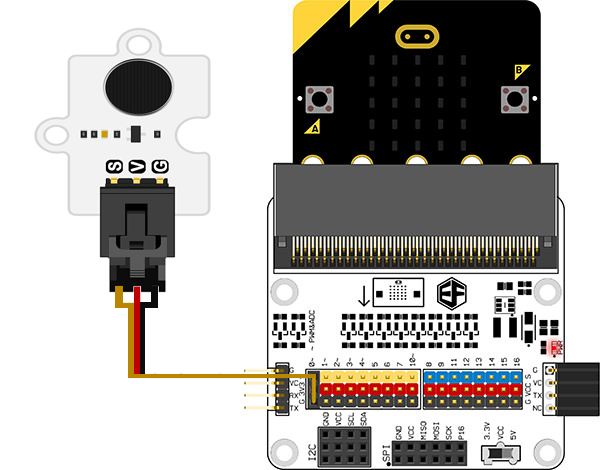

# Octopus Passive buzzer Brick OBPB01(EF04031)

## Introduction

 Octopus Passive Buzzer Brick is based on a passive buzzer, it could control the volume by PWM. 

 

## Products Link

[ELECFREAKS Octopus Passive Buzzer Brick](https://www.elecfreaks.com/octopus-passive-buzzer-brick-obpb01.html)

## Characteristics

 The 3-pins ports is easy to plug and play.
 It can work with micro:bit in 3V. 

## Specifications

Item | Parameter 
:-: | :-: 
SKU|EF04031
Power Supply|3V-5.5V
Connector Type|Analog
Pins Definition|1-Signal 2-VCC 3-GND
Response|Quick response with high sensitivity
Circuit|Simple
Stability|Stable and durable

## Outlook and Dimensions

## Quick to Start

### Materials used and connection diagram

 Connect to the P0 port as the picture shows

  Take sensor:bit for example

 

### Program as the picture shows

 Playing a melody when power is on.

 

### Reference

Links: [https://makecode.microbit.org/_Yew55FJateYP](https://makecode.microbit.org/_Yew55FJateYP)

You can also download the links below:

<iframe style="position:absolute;top:0;left:0;width:100%;height:100%;" src="https://makecode.microbit.org/#pub:_Yew55FJateYP" frameborder="0" sandbox="allow-popups allow-forms allow-scripts allow-same-origin"></iframe>
  

### Result
 The buzzer is playing a melody when power is on.

## Relevant Cases

## Technique Files

