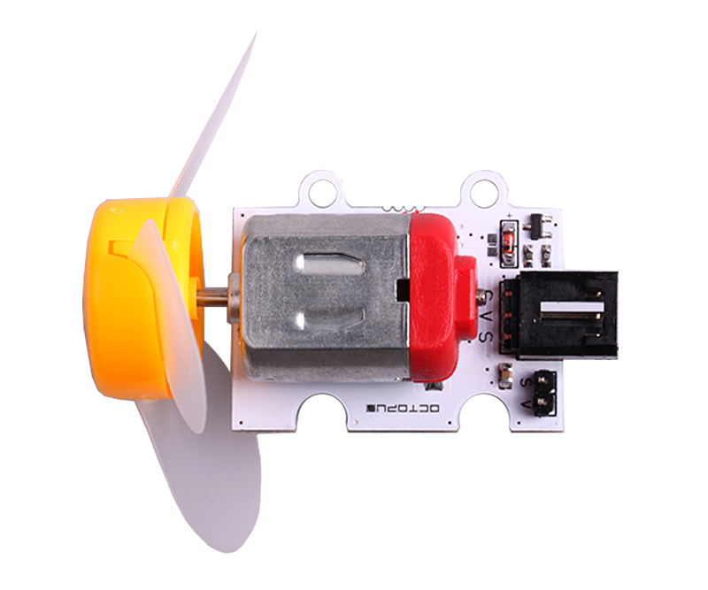
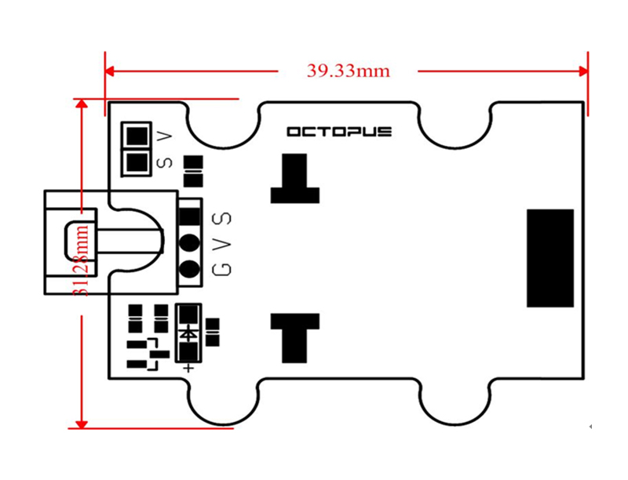
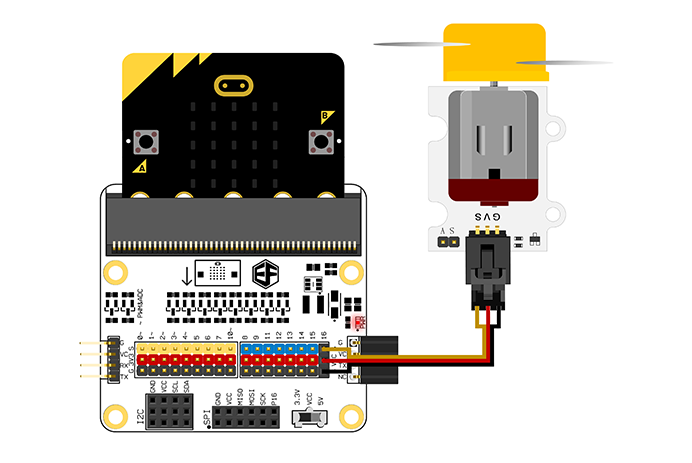
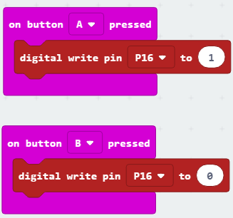

# Octopus Motor Brick

## Introduction
---
 OCTOPUS Motor Brick is a type of simple electronic building blocks of the fan motor drive module.

 

## Characteristics
---
- The 3-pins ports is easy to plug and play.

## Specifications
---
Item | Parameter 
:-: | :-: 
Power Supply | 3.3V-5V
N-MOS| IRLML2502TRPBF can support high currency power 
Low power consumption|Working current 120mA
Working Temperature|-25~85℃
Size|39.33mm×31.28mm

## Outlook and Dimensions
---

 

## Quick to Start
---
### Materials used and connection diagram

- Connect to the P16 port as the picture shows

  Take octopus:bit for example

 

### Add Package
### Program as the picture shows
Digital read pin Pl6 to 1 from button A and pin P16 to 0 from Button B.

 

### Reference
Links: [https://makecode.microbit.org/_fUURco9Rj8mH](https://makecode.microbit.org/_fUURco9Rj8mH)

You can also download the links below:

<iframe style="position:absolute;top:0;left:0;width:100%;height:100%;" src="https://makecode.microbit.org/#pub:_fUURco9Rj8mH" frameborder="0" sandbox="allow-popups allow-forms allow-scripts allow-same-origin"></iframe>
  
---

### Result

- 当按下A键时电机旋转，当按下B键时电机停止旋转。
- While pressing button A, the motor starts rotating; while pressing button B, the motor stops rotating.

## Relevant Cases
---

## Technique Files
---
