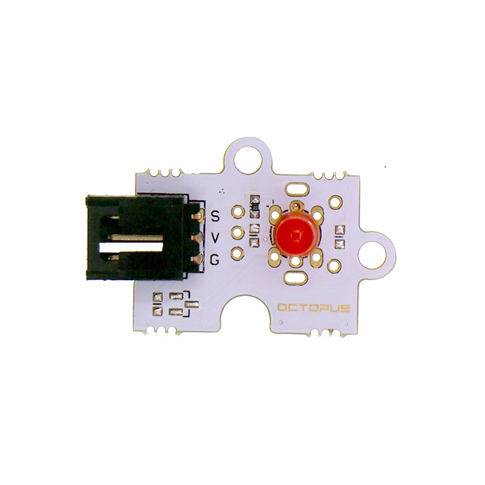
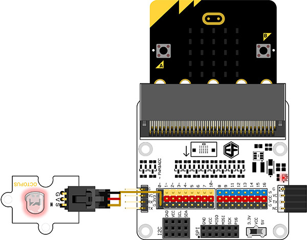

# Octopus 5mm LED Brick  Red(EF04063)

## Introduction

Octopus 5mmLED light Brick can be used in the interaction with the light works with micro:bit/Arduino.

 

## Products Link

[ELECFREAKS Octopus 5mm LED Brick OBLED - Red](https://www.elecfreaks.com/octopus-5mm-led-brick-obled-red.html)

## Characteristics

 The 3-pins ports is easy to plug and play.

## Specifications

Item | Parameter 
:-: | :-: 
SKU|EF04063
Working Voltage|3.3V-5V
Weight|5g

## Outlook and Dimensions

 

## Quick to Start

### Materials used and connection diagram

 Connect to the P0 port 

  Take octupus:bit for example

### Add Package

### Program as the picture shows

 Digital write pin P0 to 1 and 0 one second later.

### Reference

Links:[https://makecode.microbit.org/_J82V5PgzghKR](https://makecode.microbit.org/_J82V5PgzghKR)

You can also download the links below:

<iframe style="position:absolute;top:0;left:0;width:100%;height:100%;" src="https://makecode.microbit.org/#pub:_J82V5PgzghKR" frameborder="0" sandbox="allow-popups allow-forms allow-scripts allow-same-origin"></iframe>
  

### Result

 LED flashes each second.

## Relevant Cases

## Technique Files

