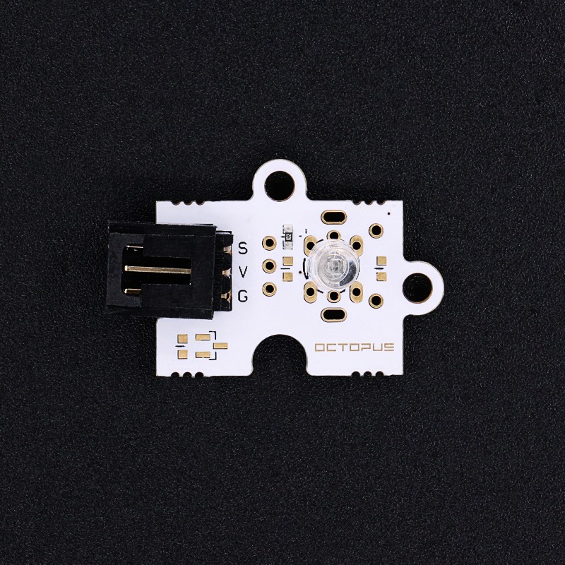
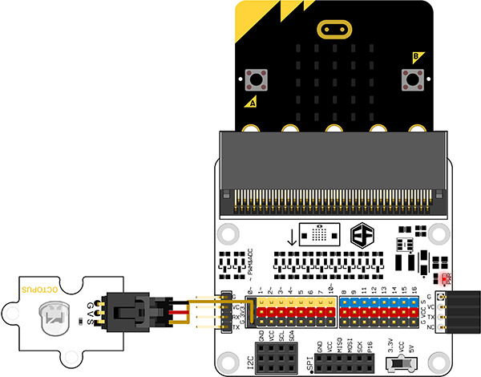
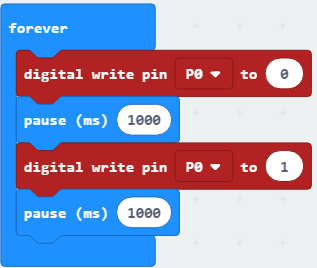

# Octopus 5mm LED Brick - White(EF04065)

## Introduction
---
Octopus 5mmLED light Brick can be used in the interaction with the light works with micro:bit/Arduino.

 
 
## Products Link

[ELECFREAKS Octopus 5mm LED Brick - White](https://shop.elecfreaks.com/products/elecfreaks-octopus-5mm-led-brick-white?_pos=1&_sid=07fafd6c5&_ss=r)

## Characteristics
---

- The 3-pins ports is easy to plug and play.

## Specifications
---

Item | Parameter 
:-: | :-: 
SKU|EF04065
Working Voltage|3.3V~5V
Weight|5g

## Outlook and Dimensions
---

 

## Quick to Start
---
### Materials used and connection diagram

- Connect to the P0 port 

  Take octupus:bit for example

### Add Package
Click "Advanced"in the choice of the MakeCode to find more choices.

Click "Extensions", search "oled"in the dialog box and then download the "oled-ssd1306".

### Program as the picture shows
Digital write pin P0 to 1 and 0 one second later.

### Reference

Links:[https://makecode.microbit.org/_J82V5PgzghKR](https://makecode.microbit.org/_J82V5PgzghKR)

You can also download the links below:

<iframe style="position:absolute;top:0;left:0;width:100%;height:100%;" src="https://makecode.microbit.org/#pub:_J82V5PgzghKR" frameborder="0" sandbox="allow-popups allow-forms allow-scripts allow-same-origin"></iframe>
  

### Result

- LED flashes each second.

## Relevant Cases
---

## Technique Files
---
