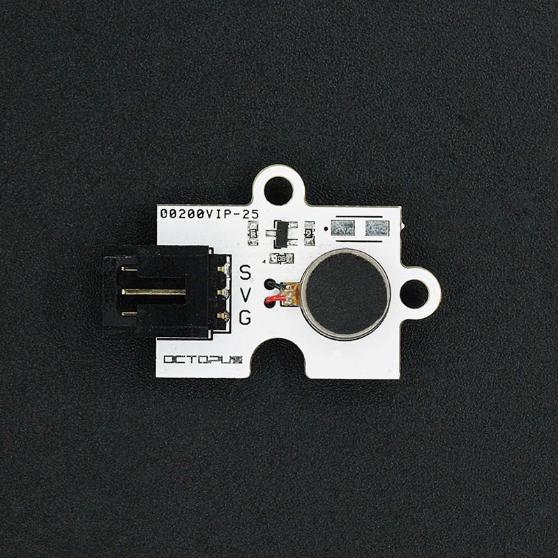
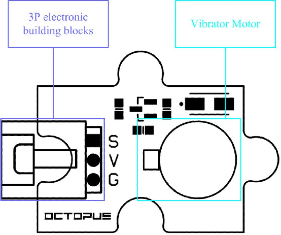
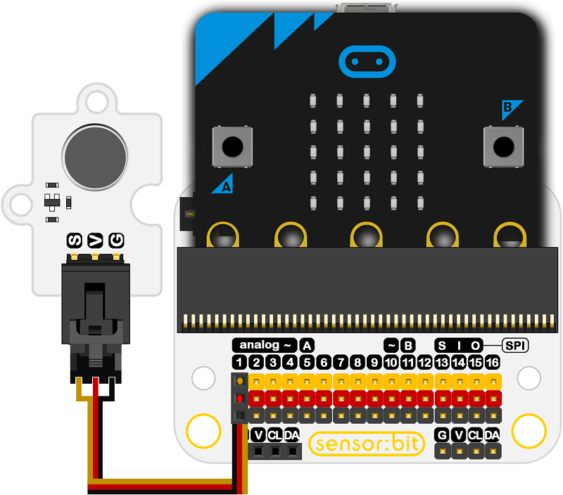
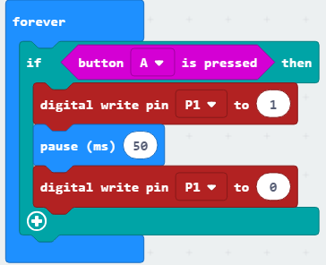

# OCTOPUS Vibration Motor

## Introduction
---
OCTOPUS Vibration Motor is a kind of electric brick module carrying with a small vibrator driven by high voltage. It can be used as vibrators for products like toys, mobiles and so on.

 

- ## Characteristics

  ------

  The 3-pins ports is easy to plug and play.

## Specifications
---
Item | Parameter 
:-: | :-: 
SKU|EF04074
Working Voltage|+ 3.3-5V
Weight|5g
Power Dissipation|ULP
Working Current|80mA（MAX）
Working Temperature|-20~70℃
Size|31.28mm×23.48mm

## Outlook and Dimensions
---

## Quick to Start

### Materials used and connection diagram

- Connect to the P1 port 

  Take sensor:bit for example

### Add Package

### Program as the picture shows

### Reference

Links:[https://makecode.microbit.org/_K3ydU0V389k2](https://makecode.microbit.org/_K3ydU0V389k2)

You can also download the links below:

<iframe style="position:absolute;top:0;left:0;width:100%;height:100%;" src="https://makecode.microbit.org/#pub:_K3ydU0V389k2" frameborder="0" sandbox="allow-popups allow-forms allow-scripts allow-same-origin"></iframe>
  
---

### Result
- The module starts vibrating after pressing button A.

## Relevant Cases

------

## Technique Files

---
